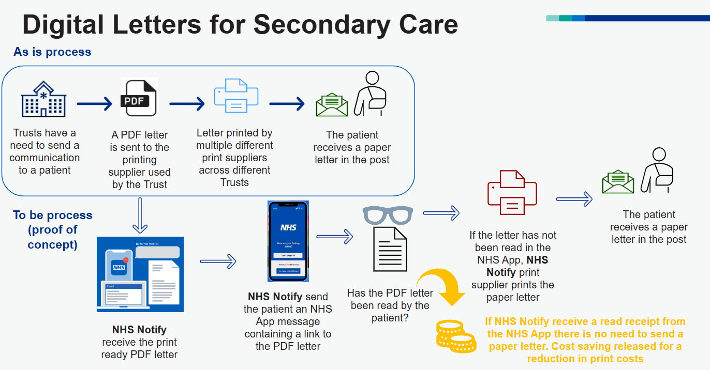

# NHS Notify Digital Letters

[](https://github.com/NHSDigital/nhs-notify-digital-letters/actions/workflows/cicd-1-pull-request.yaml)
[](https://sonarcloud.io/summary/new_code?id=NHSDigital_nhs-notify-digital-letters)

This repository contains the infrastructure and code required to deliver letters digitally that would traditionally be printed and posted.

NHS Trusts currently generate a high volume of letters for patients and other care providers, most of which are still sent in printed form. This project enables those letters to be delivered through the NHS App in digital form, with a fallback to printed letter.

## Table of Contents

- [NHS Notify Digital Letters](#nhs-notify-digital-letters)
  - [Table of Contents](#table-of-contents)
  - [Setup](#setup)
    - [Prerequisites](#prerequisites)
    - [Configuration](#configuration)
  - [Usage](#usage)
    - [Testing](#testing)
  - [CloudEvents Schemas](#cloudevents-schemas)
  - [Common Schemas (Shared Across All Domains)](#common-schemas-shared-across-all-domains)
  - [Digital Letters Domain](#digital-letters-domain)
    - [Version: 2025-10-draft](#version-2025-10-draft)
      - [Example Events](#example-events)
  - [Design](#design)
    - [Diagrams](#diagrams)
  - [Contacts](#contacts)
  - [Licence](#licence)

## Setup

Clone the repository

```shell
git clone https://github.com/NHSDigital/nhs-notify-digital-letters.git
cd nhs-notify-digital-letters
code protject.code-workspace
```

Reopen with container

```shell
make debug
```

### Prerequisites

The following software packages, or their equivalents, are expected to be installed and configured:

- [Docker](https://www.docker.com/) container runtime or a compatible tool, e.g. [Podman](https://podman.io/), [Rancher](https://rancherdesktop.io/)
- [asdf](https://asdf-vm.com/) version manager,
- [GNU make](https://www.gnu.org/software/make/) 3.82 or later,

> [!NOTE]<br>
> The version of GNU make available by default on macOS is earlier than 3.82. You will need to upgrade it or certain `make` tasks will fail. On macOS, you will need [Homebrew](https://brew.sh/) installed, then to install `make`, like so:
>
> ```shell
> brew install make
> ```
>
> You will then see instructions to fix your [`$PATH`](https://github.com/nhs-england-tools/dotfiles/blob/main/dot_path.tmpl) variable to make the newly installed version available. If you are using [dotfiles](https://github.com/nhs-england-tools/dotfiles), this is all done for you.

- [GNU sed](https://www.gnu.org/software/sed/) and [GNU grep](https://www.gnu.org/software/grep/) are required for the scripted command-line output processing,
- [GNU coreutils](https://www.gnu.org/software/coreutils/) and [GNU binutils](https://www.gnu.org/software/binutils/) may be required to build dependencies like Python, which may need to be compiled during installation,

> [!NOTE]<br>
> For macOS users, installation of the GNU toolchain has been scripted and automated as part of the `dotfiles` project. Please see this [script](https://github.com/nhs-england-tools/dotfiles/blob/main/assets/20-install-base-packages.macos.sh) for details.

- [Python](https://www.python.org/) required to run Git hooks,
- [`jq`](https://jqlang.github.io/jq/) a lightweight and flexible command-line JSON processor.

### Configuration

Installation and configuration of the toolchain dependencies

```shell
make config
```

## Usage

### Testing

There are `make` tasks for you to configure to run your tests.  Run `make test` to see how they work.  You should be able to use the same entry points for local development as in your CI pipeline.

## CloudEvents Schemas

This section contains automatically generated documentation for CloudEvents schemas.

<!-- AUTO-GENERATED-CONTENT:START -->
## Common Schemas (Shared Across All Domains)

_No common schemas defined yet._

## Digital Letters Domain

**Purpose:** Production domain for digital letters events

### Version: 2025-10-draft

| Schema Type | Source (YAML) | Published Schema | Documentation |
| ----------- | ------------- | ---------------- | ------------- |
| **Core.request.submitted Data.v1** | [`src/digital-letters/2025-10-draft/data/core.request.submitted-data.v1.schema.yaml`](src/digital-letters/2025-10-draft/data/core.request.submitted-data.v1.schema.yaml) | [`schemas/digital-letters/2025-10-draft/data/core.request.submitted-data.v1.schema.json`](schemas/digital-letters/2025-10-draft/data/core.request.submitted-data.v1.schema.json) | [`../../docs/cloudevents/digital-letters/2025-10-draft/data/core.request.submitted-data.v1.schema.md`](../../docs/cloudevents/digital-letters/2025-10-draft/data/core.request.submitted-data.v1.schema.md) |
| **Digital Letter Base Data** | [`src/digital-letters/2025-10-draft/data/digital-letter-base-data.schema.yaml`](src/digital-letters/2025-10-draft/data/digital-letter-base-data.schema.yaml) | [`schemas/digital-letters/2025-10-draft/data/digital-letter-base-data.schema.json`](schemas/digital-letters/2025-10-draft/data/digital-letter-base-data.schema.json) | [`../../docs/cloudevents/digital-letters/2025-10-draft/data/digital-letter-base-data.schema.md`](../../docs/cloudevents/digital-letters/2025-10-draft/data/digital-letter-base-data.schema.md) |
| **Digital Letters Digital Letter Read Data** | [`src/digital-letters/2025-10-draft/data/digital-letters-digital-letter-read-data.schema.yaml`](src/digital-letters/2025-10-draft/data/digital-letters-digital-letter-read-data.schema.yaml) | [`schemas/digital-letters/2025-10-draft/data/digital-letters-digital-letter-read-data.schema.json`](schemas/digital-letters/2025-10-draft/data/digital-letters-digital-letter-read-data.schema.json) | [`../../docs/cloudevents/digital-letters/2025-10-draft/data/digital-letters-digital-letter-read-data.schema.md`](../../docs/cloudevents/digital-letters/2025-10-draft/data/digital-letters-digital-letter-read-data.schema.md) |
| **Digital Letters Mesh Inbox Message Downloaded Data** | [`src/digital-letters/2025-10-draft/data/digital-letters-mesh-inbox-message-downloaded-data.schema.yaml`](src/digital-letters/2025-10-draft/data/digital-letters-mesh-inbox-message-downloaded-data.schema.yaml) | [`schemas/digital-letters/2025-10-draft/data/digital-letters-mesh-inbox-message-downloaded-data.schema.json`](schemas/digital-letters/2025-10-draft/data/digital-letters-mesh-inbox-message-downloaded-data.schema.json) | [`../../docs/cloudevents/digital-letters/2025-10-draft/data/digital-letters-mesh-inbox-message-downloaded-data.schema.md`](../../docs/cloudevents/digital-letters/2025-10-draft/data/digital-letters-mesh-inbox-message-downloaded-data.schema.md) |
| **Digital Letters Mesh Inbox Message Received Data** | [`src/digital-letters/2025-10-draft/data/digital-letters-mesh-inbox-message-received-data.schema.yaml`](src/digital-letters/2025-10-draft/data/digital-letters-mesh-inbox-message-received-data.schema.yaml) | [`schemas/digital-letters/2025-10-draft/data/digital-letters-mesh-inbox-message-received-data.schema.json`](schemas/digital-letters/2025-10-draft/data/digital-letters-mesh-inbox-message-received-data.schema.json) | [`../../docs/cloudevents/digital-letters/2025-10-draft/data/digital-letters-mesh-inbox-message-received-data.schema.md`](../../docs/cloudevents/digital-letters/2025-10-draft/data/digital-letters-mesh-inbox-message-received-data.schema.md) |
| **Digital Letters Message Request Rejected Data** | [`src/digital-letters/2025-10-draft/data/digital-letters-message-request-rejected-data.schema.yaml`](src/digital-letters/2025-10-draft/data/digital-letters-message-request-rejected-data.schema.yaml) | [`schemas/digital-letters/2025-10-draft/data/digital-letters-message-request-rejected-data.schema.json`](schemas/digital-letters/2025-10-draft/data/digital-letters-message-request-rejected-data.schema.json) | [`../../docs/cloudevents/digital-letters/2025-10-draft/data/digital-letters-message-request-rejected-data.schema.md`](../../docs/cloudevents/digital-letters/2025-10-draft/data/digital-letters-message-request-rejected-data.schema.md) |
| **Digital Letters Message Request Skipped Data** | [`src/digital-letters/2025-10-draft/data/digital-letters-message-request-skipped-data.schema.yaml`](src/digital-letters/2025-10-draft/data/digital-letters-message-request-skipped-data.schema.yaml) | [`schemas/digital-letters/2025-10-draft/data/digital-letters-message-request-skipped-data.schema.json`](schemas/digital-letters/2025-10-draft/data/digital-letters-message-request-skipped-data.schema.json) | [`../../docs/cloudevents/digital-letters/2025-10-draft/data/digital-letters-message-request-skipped-data.schema.md`](../../docs/cloudevents/digital-letters/2025-10-draft/data/digital-letters-message-request-skipped-data.schema.md) |
| **Digital Letters Message Request Submitted Data** | [`src/digital-letters/2025-10-draft/data/digital-letters-message-request-submitted-data.schema.yaml`](src/digital-letters/2025-10-draft/data/digital-letters-message-request-submitted-data.schema.yaml) | [`schemas/digital-letters/2025-10-draft/data/digital-letters-message-request-submitted-data.schema.json`](schemas/digital-letters/2025-10-draft/data/digital-letters-message-request-submitted-data.schema.json) | [`../../docs/cloudevents/digital-letters/2025-10-draft/data/digital-letters-message-request-submitted-data.schema.md`](../../docs/cloudevents/digital-letters/2025-10-draft/data/digital-letters-message-request-submitted-data.schema.md) |
| **Digital Letters Pdm Resource Available Data** | [`src/digital-letters/2025-10-draft/data/digital-letters-pdm-resource-available-data.schema.yaml`](src/digital-letters/2025-10-draft/data/digital-letters-pdm-resource-available-data.schema.yaml) | [`schemas/digital-letters/2025-10-draft/data/digital-letters-pdm-resource-available-data.schema.json`](schemas/digital-letters/2025-10-draft/data/digital-letters-pdm-resource-available-data.schema.json) | [`../../docs/cloudevents/digital-letters/2025-10-draft/data/digital-letters-pdm-resource-available-data.schema.md`](../../docs/cloudevents/digital-letters/2025-10-draft/data/digital-letters-pdm-resource-available-data.schema.md) |
| **Digital Letters Pdm Resource Retries Exceeded Data** | [`src/digital-letters/2025-10-draft/data/digital-letters-pdm-resource-retries-exceeded-data.schema.yaml`](src/digital-letters/2025-10-draft/data/digital-letters-pdm-resource-retries-exceeded-data.schema.yaml) | [`schemas/digital-letters/2025-10-draft/data/digital-letters-pdm-resource-retries-exceeded-data.schema.json`](schemas/digital-letters/2025-10-draft/data/digital-letters-pdm-resource-retries-exceeded-data.schema.json) | [`../../docs/cloudevents/digital-letters/2025-10-draft/data/digital-letters-pdm-resource-retries-exceeded-data.schema.md`](../../docs/cloudevents/digital-letters/2025-10-draft/data/digital-letters-pdm-resource-retries-exceeded-data.schema.md) |
| **Digital Letters Pdm Resource Submission Rejected Data** | [`src/digital-letters/2025-10-draft/data/digital-letters-pdm-resource-submission-rejected-data.schema.yaml`](src/digital-letters/2025-10-draft/data/digital-letters-pdm-resource-submission-rejected-data.schema.yaml) | [`schemas/digital-letters/2025-10-draft/data/digital-letters-pdm-resource-submission-rejected-data.schema.json`](schemas/digital-letters/2025-10-draft/data/digital-letters-pdm-resource-submission-rejected-data.schema.json) | [`../../docs/cloudevents/digital-letters/2025-10-draft/data/digital-letters-pdm-resource-submission-rejected-data.schema.md`](../../docs/cloudevents/digital-letters/2025-10-draft/data/digital-letters-pdm-resource-submission-rejected-data.schema.md) |
| **Digital Letters Pdm Resource Submitted Data** | [`src/digital-letters/2025-10-draft/data/digital-letters-pdm-resource-submitted-data.schema.yaml`](src/digital-letters/2025-10-draft/data/digital-letters-pdm-resource-submitted-data.schema.yaml) | [`schemas/digital-letters/2025-10-draft/data/digital-letters-pdm-resource-submitted-data.schema.json`](schemas/digital-letters/2025-10-draft/data/digital-letters-pdm-resource-submitted-data.schema.json) | [`../../docs/cloudevents/digital-letters/2025-10-draft/data/digital-letters-pdm-resource-submitted-data.schema.md`](../../docs/cloudevents/digital-letters/2025-10-draft/data/digital-letters-pdm-resource-submitted-data.schema.md) |
| **Digital Letters Pdm Resource Unavailable Data** | [`src/digital-letters/2025-10-draft/data/digital-letters-pdm-resource-unavailable-data.schema.yaml`](src/digital-letters/2025-10-draft/data/digital-letters-pdm-resource-unavailable-data.schema.yaml) | [`schemas/digital-letters/2025-10-draft/data/digital-letters-pdm-resource-unavailable-data.schema.json`](schemas/digital-letters/2025-10-draft/data/digital-letters-pdm-resource-unavailable-data.schema.json) | [`../../docs/cloudevents/digital-letters/2025-10-draft/data/digital-letters-pdm-resource-unavailable-data.schema.md`](../../docs/cloudevents/digital-letters/2025-10-draft/data/digital-letters-pdm-resource-unavailable-data.schema.md) |
| **Digital Letters Queue Item Dequeued Data** | [`src/digital-letters/2025-10-draft/data/digital-letters-queue-item-dequeued-data.schema.yaml`](src/digital-letters/2025-10-draft/data/digital-letters-queue-item-dequeued-data.schema.yaml) | [`schemas/digital-letters/2025-10-draft/data/digital-letters-queue-item-dequeued-data.schema.json`](schemas/digital-letters/2025-10-draft/data/digital-letters-queue-item-dequeued-data.schema.json) | [`../../docs/cloudevents/digital-letters/2025-10-draft/data/digital-letters-queue-item-dequeued-data.schema.md`](../../docs/cloudevents/digital-letters/2025-10-draft/data/digital-letters-queue-item-dequeued-data.schema.md) |
| **Digital Letters Queue Item Enqueued Data** | [`src/digital-letters/2025-10-draft/data/digital-letters-queue-item-enqueued-data.schema.yaml`](src/digital-letters/2025-10-draft/data/digital-letters-queue-item-enqueued-data.schema.yaml) | [`schemas/digital-letters/2025-10-draft/data/digital-letters-queue-item-enqueued-data.schema.json`](schemas/digital-letters/2025-10-draft/data/digital-letters-queue-item-enqueued-data.schema.json) | [`../../docs/cloudevents/digital-letters/2025-10-draft/data/digital-letters-queue-item-enqueued-data.schema.md`](../../docs/cloudevents/digital-letters/2025-10-draft/data/digital-letters-queue-item-enqueued-data.schema.md) |
| **Digital Letters Queue Item Removed Data** | [`src/digital-letters/2025-10-draft/data/digital-letters-queue-item-removed-data.schema.yaml`](src/digital-letters/2025-10-draft/data/digital-letters-queue-item-removed-data.schema.yaml) | [`schemas/digital-letters/2025-10-draft/data/digital-letters-queue-item-removed-data.schema.json`](schemas/digital-letters/2025-10-draft/data/digital-letters-queue-item-removed-data.schema.json) | [`../../docs/cloudevents/digital-letters/2025-10-draft/data/digital-letters-queue-item-removed-data.schema.md`](../../docs/cloudevents/digital-letters/2025-10-draft/data/digital-letters-queue-item-removed-data.schema.md) |
| **Digital Letters Reporting Generate Report Data** | [`src/digital-letters/2025-10-draft/data/digital-letters-reporting-generate-report-data.schema.yaml`](src/digital-letters/2025-10-draft/data/digital-letters-reporting-generate-report-data.schema.yaml) | [`schemas/digital-letters/2025-10-draft/data/digital-letters-reporting-generate-report-data.schema.json`](schemas/digital-letters/2025-10-draft/data/digital-letters-reporting-generate-report-data.schema.json) | [`../../docs/cloudevents/digital-letters/2025-10-draft/data/digital-letters-reporting-generate-report-data.schema.md`](../../docs/cloudevents/digital-letters/2025-10-draft/data/digital-letters-reporting-generate-report-data.schema.md) |
| **Digital Letters Reporting Report Generated Data** | [`src/digital-letters/2025-10-draft/data/digital-letters-reporting-report-generated-data.schema.yaml`](src/digital-letters/2025-10-draft/data/digital-letters-reporting-report-generated-data.schema.yaml) | [`schemas/digital-letters/2025-10-draft/data/digital-letters-reporting-report-generated-data.schema.json`](schemas/digital-letters/2025-10-draft/data/digital-letters-reporting-report-generated-data.schema.json) | [`../../docs/cloudevents/digital-letters/2025-10-draft/data/digital-letters-reporting-report-generated-data.schema.md`](../../docs/cloudevents/digital-letters/2025-10-draft/data/digital-letters-reporting-report-generated-data.schema.md) |
| **Digital Letters Reporting Report Sent Data** | [`src/digital-letters/2025-10-draft/data/digital-letters-reporting-report-sent-data.schema.yaml`](src/digital-letters/2025-10-draft/data/digital-letters-reporting-report-sent-data.schema.yaml) | [`schemas/digital-letters/2025-10-draft/data/digital-letters-reporting-report-sent-data.schema.json`](schemas/digital-letters/2025-10-draft/data/digital-letters-reporting-report-sent-data.schema.json) | [`../../docs/cloudevents/digital-letters/2025-10-draft/data/digital-letters-reporting-report-sent-data.schema.md`](../../docs/cloudevents/digital-letters/2025-10-draft/data/digital-letters-reporting-report-sent-data.schema.md) |
| **Core** | [`src/digital-letters/2025-10-draft/defs/core.schema.yaml`](src/digital-letters/2025-10-draft/defs/core.schema.yaml) | [`schemas/digital-letters/2025-10-draft/defs/core.schema.json`](schemas/digital-letters/2025-10-draft/defs/core.schema.json) | [`../../docs/cloudevents/digital-letters/2025-10-draft/defs/core.schema.md`](../../docs/cloudevents/digital-letters/2025-10-draft/defs/core.schema.md) |
| **Mesh** | [`src/digital-letters/2025-10-draft/defs/mesh.schema.yaml`](src/digital-letters/2025-10-draft/defs/mesh.schema.yaml) | [`schemas/digital-letters/2025-10-draft/defs/mesh.schema.json`](schemas/digital-letters/2025-10-draft/defs/mesh.schema.json) | [`../../docs/cloudevents/digital-letters/2025-10-draft/defs/mesh.schema.md`](../../docs/cloudevents/digital-letters/2025-10-draft/defs/mesh.schema.md) |
| **Message Id** | [`src/digital-letters/2025-10-draft/defs/message-id.schema.yaml`](src/digital-letters/2025-10-draft/defs/message-id.schema.yaml) | [`schemas/digital-letters/2025-10-draft/defs/message-id.schema.json`](schemas/digital-letters/2025-10-draft/defs/message-id.schema.json) | [`../../docs/cloudevents/digital-letters/2025-10-draft/defs/message-id.schema.md`](../../docs/cloudevents/digital-letters/2025-10-draft/defs/message-id.schema.md) |
| **Message Status** | [`src/digital-letters/2025-10-draft/defs/message-status.schema.yaml`](src/digital-letters/2025-10-draft/defs/message-status.schema.yaml) | [`schemas/digital-letters/2025-10-draft/defs/message-status.schema.json`](schemas/digital-letters/2025-10-draft/defs/message-status.schema.json) | [`../../docs/cloudevents/digital-letters/2025-10-draft/defs/message-status.schema.md`](../../docs/cloudevents/digital-letters/2025-10-draft/defs/message-status.schema.md) |
| **Pdm** | [`src/digital-letters/2025-10-draft/defs/pdm.schema.yaml`](src/digital-letters/2025-10-draft/defs/pdm.schema.yaml) | [`schemas/digital-letters/2025-10-draft/defs/pdm.schema.json`](schemas/digital-letters/2025-10-draft/defs/pdm.schema.json) | [`../../docs/cloudevents/digital-letters/2025-10-draft/defs/pdm.schema.md`](../../docs/cloudevents/digital-letters/2025-10-draft/defs/pdm.schema.md) |
| **Reporting** | [`src/digital-letters/2025-10-draft/defs/reporting.schema.yaml`](src/digital-letters/2025-10-draft/defs/reporting.schema.yaml) | [`schemas/digital-letters/2025-10-draft/defs/reporting.schema.json`](schemas/digital-letters/2025-10-draft/defs/reporting.schema.json) | [`../../docs/cloudevents/digital-letters/2025-10-draft/defs/reporting.schema.md`](../../docs/cloudevents/digital-letters/2025-10-draft/defs/reporting.schema.md) |
| **Requests** | [`src/digital-letters/2025-10-draft/defs/requests.schema.yaml`](src/digital-letters/2025-10-draft/defs/requests.schema.yaml) | [`schemas/digital-letters/2025-10-draft/defs/requests.schema.json`](schemas/digital-letters/2025-10-draft/defs/requests.schema.json) | [`../../docs/cloudevents/digital-letters/2025-10-draft/defs/requests.schema.md`](../../docs/cloudevents/digital-letters/2025-10-draft/defs/requests.schema.md) |
| **Some.object** | [`src/digital-letters/2025-10-draft/defs/some.object.schema.yaml`](src/digital-letters/2025-10-draft/defs/some.object.schema.yaml) | [`schemas/digital-letters/2025-10-draft/defs/some.object.schema.json`](schemas/digital-letters/2025-10-draft/defs/some.object.schema.json) | [`../../docs/cloudevents/digital-letters/2025-10-draft/defs/some.object.schema.md`](../../docs/cloudevents/digital-letters/2025-10-draft/defs/some.object.schema.md) |
| **Profile** | [`src/digital-letters/2025-10-draft/digital-letters-event-bus-profile.schema.yaml`](src/digital-letters/2025-10-draft/digital-letters-event-bus-profile.schema.yaml) | [`schemas/digital-letters/2025-10-draft/digital-letters-event-bus-profile.schema.json`](schemas/digital-letters/2025-10-draft/digital-letters-event-bus-profile.schema.json) | [`../../docs/cloudevents/digital-letters/2025-10-draft/digital-letters-event-bus-profile.schema.md`](../../docs/cloudevents/digital-letters/2025-10-draft/digital-letters-event-bus-profile.schema.md) |
| **Profile** | [`src/digital-letters/2025-10-draft/digital-letters-fhir-profile.schema.yaml`](src/digital-letters/2025-10-draft/digital-letters-fhir-profile.schema.yaml) | [`schemas/digital-letters/2025-10-draft/digital-letters-fhir-profile.schema.json`](schemas/digital-letters/2025-10-draft/digital-letters-fhir-profile.schema.json) | [`../../docs/cloudevents/digital-letters/2025-10-draft/digital-letters-fhir-profile.schema.md`](../../docs/cloudevents/digital-letters/2025-10-draft/digital-letters-fhir-profile.schema.md) |
| **Profile** | [`src/digital-letters/2025-10-draft/digital-letters-letter-profile.schema.yaml`](src/digital-letters/2025-10-draft/digital-letters-letter-profile.schema.yaml) | [`schemas/digital-letters/2025-10-draft/digital-letters-letter-profile.schema.json`](schemas/digital-letters/2025-10-draft/digital-letters-letter-profile.schema.json) | [`../../docs/cloudevents/digital-letters/2025-10-draft/digital-letters-letter-profile.schema.md`](../../docs/cloudevents/digital-letters/2025-10-draft/digital-letters-letter-profile.schema.md) |
| **Profile** | [`src/digital-letters/2025-10-draft/digital-letters-mesh-profile.schema.yaml`](src/digital-letters/2025-10-draft/digital-letters-mesh-profile.schema.yaml) | [`schemas/digital-letters/2025-10-draft/digital-letters-mesh-profile.schema.json`](schemas/digital-letters/2025-10-draft/digital-letters-mesh-profile.schema.json) | [`../../docs/cloudevents/digital-letters/2025-10-draft/digital-letters-mesh-profile.schema.md`](../../docs/cloudevents/digital-letters/2025-10-draft/digital-letters-mesh-profile.schema.md) |
| **Profile** | [`src/digital-letters/2025-10-draft/digital-letters-messages-profile.schema.yaml`](src/digital-letters/2025-10-draft/digital-letters-messages-profile.schema.yaml) | [`schemas/digital-letters/2025-10-draft/digital-letters-messages-profile.schema.json`](schemas/digital-letters/2025-10-draft/digital-letters-messages-profile.schema.json) | [`../../docs/cloudevents/digital-letters/2025-10-draft/digital-letters-messages-profile.schema.md`](../../docs/cloudevents/digital-letters/2025-10-draft/digital-letters-messages-profile.schema.md) |
| **Profile** | [`src/digital-letters/2025-10-draft/digital-letters-pdm-profile.schema.yaml`](src/digital-letters/2025-10-draft/digital-letters-pdm-profile.schema.yaml) | [`schemas/digital-letters/2025-10-draft/digital-letters-pdm-profile.schema.json`](schemas/digital-letters/2025-10-draft/digital-letters-pdm-profile.schema.json) | [`../../docs/cloudevents/digital-letters/2025-10-draft/digital-letters-pdm-profile.schema.md`](../../docs/cloudevents/digital-letters/2025-10-draft/digital-letters-pdm-profile.schema.md) |
| **Profile** | [`src/digital-letters/2025-10-draft/digital-letters-print-profile.schema.yaml`](src/digital-letters/2025-10-draft/digital-letters-print-profile.schema.yaml) | [`schemas/digital-letters/2025-10-draft/digital-letters-print-profile.schema.json`](schemas/digital-letters/2025-10-draft/digital-letters-print-profile.schema.json) | [`../../docs/cloudevents/digital-letters/2025-10-draft/digital-letters-print-profile.schema.md`](../../docs/cloudevents/digital-letters/2025-10-draft/digital-letters-print-profile.schema.md) |
| **Profile** | [`src/digital-letters/2025-10-draft/digital-letters-profile.schema.yaml`](src/digital-letters/2025-10-draft/digital-letters-profile.schema.yaml) | [`schemas/digital-letters/2025-10-draft/digital-letters-profile.schema.json`](schemas/digital-letters/2025-10-draft/digital-letters-profile.schema.json) | [`../../docs/cloudevents/digital-letters/2025-10-draft/digital-letters-profile.schema.md`](../../docs/cloudevents/digital-letters/2025-10-draft/digital-letters-profile.schema.md) |
| **Profile** | [`src/digital-letters/2025-10-draft/digital-letters-queue-profile.schema.yaml`](src/digital-letters/2025-10-draft/digital-letters-queue-profile.schema.yaml) | [`schemas/digital-letters/2025-10-draft/digital-letters-queue-profile.schema.json`](schemas/digital-letters/2025-10-draft/digital-letters-queue-profile.schema.json) | [`../../docs/cloudevents/digital-letters/2025-10-draft/digital-letters-queue-profile.schema.md`](../../docs/cloudevents/digital-letters/2025-10-draft/digital-letters-queue-profile.schema.md) |
| **Profile** | [`src/digital-letters/2025-10-draft/digital-letters-reporting-profile.schema.yaml`](src/digital-letters/2025-10-draft/digital-letters-reporting-profile.schema.yaml) | [`schemas/digital-letters/2025-10-draft/digital-letters-reporting-profile.schema.json`](schemas/digital-letters/2025-10-draft/digital-letters-reporting-profile.schema.json) | [`../../docs/cloudevents/digital-letters/2025-10-draft/digital-letters-reporting-profile.schema.md`](../../docs/cloudevents/digital-letters/2025-10-draft/digital-letters-reporting-profile.schema.md) |
| **Profile** | [`src/digital-letters/2025-10-draft/digital-letters-viewer-profile.schema.yaml`](src/digital-letters/2025-10-draft/digital-letters-viewer-profile.schema.yaml) | [`schemas/digital-letters/2025-10-draft/digital-letters-viewer-profile.schema.json`](schemas/digital-letters/2025-10-draft/digital-letters-viewer-profile.schema.json) | [`../../docs/cloudevents/digital-letters/2025-10-draft/digital-letters-viewer-profile.schema.md`](../../docs/cloudevents/digital-letters/2025-10-draft/digital-letters-viewer-profile.schema.md) |
| **uk.nhs.notify.digital.letters.letter.available.v1** | [`src/digital-letters/2025-10-draft/events/uk.nhs.notify.digital.letters.letter.available.v1.schema.yaml`](src/digital-letters/2025-10-draft/events/uk.nhs.notify.digital.letters.letter.available.v1.schema.yaml) | [`schemas/digital-letters/2025-10-draft/events/uk.nhs.notify.digital.letters.letter.available.v1.schema.json`](schemas/digital-letters/2025-10-draft/events/uk.nhs.notify.digital.letters.letter.available.v1.schema.json) | [`../../docs/cloudevents/digital-letters/2025-10-draft/events/uk.nhs.notify.digital.letters.letter.available.v1.schema.md`](../../docs/cloudevents/digital-letters/2025-10-draft/events/uk.nhs.notify.digital.letters.letter.available.v1.schema.md) |
| **uk.nhs.notify.digital.letters.mesh.inbox.message.downloaded.v1** | [`src/digital-letters/2025-10-draft/events/uk.nhs.notify.digital.letters.mesh.inbox.message.downloaded.v1.schema.yaml`](src/digital-letters/2025-10-draft/events/uk.nhs.notify.digital.letters.mesh.inbox.message.downloaded.v1.schema.yaml) | [`schemas/digital-letters/2025-10-draft/events/uk.nhs.notify.digital.letters.mesh.inbox.message.downloaded.v1.schema.json`](schemas/digital-letters/2025-10-draft/events/uk.nhs.notify.digital.letters.mesh.inbox.message.downloaded.v1.schema.json) | [`../../docs/cloudevents/digital-letters/2025-10-draft/events/uk.nhs.notify.digital.letters.mesh.inbox.message.downloaded.v1.schema.md`](../../docs/cloudevents/digital-letters/2025-10-draft/events/uk.nhs.notify.digital.letters.mesh.inbox.message.downloaded.v1.schema.md) |
| **uk.nhs.notify.digital.letters.mesh.inbox.message.received.v1** | [`src/digital-letters/2025-10-draft/events/uk.nhs.notify.digital.letters.mesh.inbox.message.received.v1.schema.yaml`](src/digital-letters/2025-10-draft/events/uk.nhs.notify.digital.letters.mesh.inbox.message.received.v1.schema.yaml) | [`schemas/digital-letters/2025-10-draft/events/uk.nhs.notify.digital.letters.mesh.inbox.message.received.v1.schema.json`](schemas/digital-letters/2025-10-draft/events/uk.nhs.notify.digital.letters.mesh.inbox.message.received.v1.schema.json) | [`../../docs/cloudevents/digital-letters/2025-10-draft/events/uk.nhs.notify.digital.letters.mesh.inbox.message.received.v1.schema.md`](../../docs/cloudevents/digital-letters/2025-10-draft/events/uk.nhs.notify.digital.letters.mesh.inbox.message.received.v1.schema.md) |
| **uk.nhs.notify.digital.letters.mesh.report.sent.v1** | [`src/digital-letters/2025-10-draft/events/uk.nhs.notify.digital.letters.mesh.report.sent.v1.schema.yaml`](src/digital-letters/2025-10-draft/events/uk.nhs.notify.digital.letters.mesh.report.sent.v1.schema.yaml) | [`schemas/digital-letters/2025-10-draft/events/uk.nhs.notify.digital.letters.mesh.report.sent.v1.schema.json`](schemas/digital-letters/2025-10-draft/events/uk.nhs.notify.digital.letters.mesh.report.sent.v1.schema.json) | [`../../docs/cloudevents/digital-letters/2025-10-draft/events/uk.nhs.notify.digital.letters.mesh.report.sent.v1.schema.md`](../../docs/cloudevents/digital-letters/2025-10-draft/events/uk.nhs.notify.digital.letters.mesh.report.sent.v1.schema.md) |
| **uk.nhs.notify.digital.letters.messages.request.rejected.v1** | [`src/digital-letters/2025-10-draft/events/uk.nhs.notify.digital.letters.messages.request.rejected.v1.schema.yaml`](src/digital-letters/2025-10-draft/events/uk.nhs.notify.digital.letters.messages.request.rejected.v1.schema.yaml) | [`schemas/digital-letters/2025-10-draft/events/uk.nhs.notify.digital.letters.messages.request.rejected.v1.schema.json`](schemas/digital-letters/2025-10-draft/events/uk.nhs.notify.digital.letters.messages.request.rejected.v1.schema.json) | [`../../docs/cloudevents/digital-letters/2025-10-draft/events/uk.nhs.notify.digital.letters.messages.request.rejected.v1.schema.md`](../../docs/cloudevents/digital-letters/2025-10-draft/events/uk.nhs.notify.digital.letters.messages.request.rejected.v1.schema.md) |
| **uk.nhs.notify.digital.letters.messages.request.skipped.v1** | [`src/digital-letters/2025-10-draft/events/uk.nhs.notify.digital.letters.messages.request.skipped.v1.schema.yaml`](src/digital-letters/2025-10-draft/events/uk.nhs.notify.digital.letters.messages.request.skipped.v1.schema.yaml) | [`schemas/digital-letters/2025-10-draft/events/uk.nhs.notify.digital.letters.messages.request.skipped.v1.schema.json`](schemas/digital-letters/2025-10-draft/events/uk.nhs.notify.digital.letters.messages.request.skipped.v1.schema.json) | [`../../docs/cloudevents/digital-letters/2025-10-draft/events/uk.nhs.notify.digital.letters.messages.request.skipped.v1.schema.md`](../../docs/cloudevents/digital-letters/2025-10-draft/events/uk.nhs.notify.digital.letters.messages.request.skipped.v1.schema.md) |
| **uk.nhs.notify.digital.letters.messages.request.submitted.v1** | [`src/digital-letters/2025-10-draft/events/uk.nhs.notify.digital.letters.messages.request.submitted.v1.schema.yaml`](src/digital-letters/2025-10-draft/events/uk.nhs.notify.digital.letters.messages.request.submitted.v1.schema.yaml) | [`schemas/digital-letters/2025-10-draft/events/uk.nhs.notify.digital.letters.messages.request.submitted.v1.schema.json`](schemas/digital-letters/2025-10-draft/events/uk.nhs.notify.digital.letters.messages.request.submitted.v1.schema.json) | [`../../docs/cloudevents/digital-letters/2025-10-draft/events/uk.nhs.notify.digital.letters.messages.request.submitted.v1.schema.md`](../../docs/cloudevents/digital-letters/2025-10-draft/events/uk.nhs.notify.digital.letters.messages.request.submitted.v1.schema.md) |
| **uk.nhs.notify.digital.letters.pdm.resource.available.v1** | [`src/digital-letters/2025-10-draft/events/uk.nhs.notify.digital.letters.pdm.resource.available.v1.schema.yaml`](src/digital-letters/2025-10-draft/events/uk.nhs.notify.digital.letters.pdm.resource.available.v1.schema.yaml) | [`schemas/digital-letters/2025-10-draft/events/uk.nhs.notify.digital.letters.pdm.resource.available.v1.schema.json`](schemas/digital-letters/2025-10-draft/events/uk.nhs.notify.digital.letters.pdm.resource.available.v1.schema.json) | [`../../docs/cloudevents/digital-letters/2025-10-draft/events/uk.nhs.notify.digital.letters.pdm.resource.available.v1.schema.md`](../../docs/cloudevents/digital-letters/2025-10-draft/events/uk.nhs.notify.digital.letters.pdm.resource.available.v1.schema.md) |
| **uk.nhs.notify.digital.letters.pdm.resource.retries.exceeded.v1** | [`src/digital-letters/2025-10-draft/events/uk.nhs.notify.digital.letters.pdm.resource.retries.exceeded.v1.schema.yaml`](src/digital-letters/2025-10-draft/events/uk.nhs.notify.digital.letters.pdm.resource.retries.exceeded.v1.schema.yaml) | [`schemas/digital-letters/2025-10-draft/events/uk.nhs.notify.digital.letters.pdm.resource.retries.exceeded.v1.schema.json`](schemas/digital-letters/2025-10-draft/events/uk.nhs.notify.digital.letters.pdm.resource.retries.exceeded.v1.schema.json) | [`../../docs/cloudevents/digital-letters/2025-10-draft/events/uk.nhs.notify.digital.letters.pdm.resource.retries.exceeded.v1.schema.md`](../../docs/cloudevents/digital-letters/2025-10-draft/events/uk.nhs.notify.digital.letters.pdm.resource.retries.exceeded.v1.schema.md) |
| **uk.nhs.notify.digital.letters.pdm.resource.submission.rejected.v1** | [`src/digital-letters/2025-10-draft/events/uk.nhs.notify.digital.letters.pdm.resource.submission.rejected.v1.schema.yaml`](src/digital-letters/2025-10-draft/events/uk.nhs.notify.digital.letters.pdm.resource.submission.rejected.v1.schema.yaml) | [`schemas/digital-letters/2025-10-draft/events/uk.nhs.notify.digital.letters.pdm.resource.submission.rejected.v1.schema.json`](schemas/digital-letters/2025-10-draft/events/uk.nhs.notify.digital.letters.pdm.resource.submission.rejected.v1.schema.json) | [`../../docs/cloudevents/digital-letters/2025-10-draft/events/uk.nhs.notify.digital.letters.pdm.resource.submission.rejected.v1.schema.md`](../../docs/cloudevents/digital-letters/2025-10-draft/events/uk.nhs.notify.digital.letters.pdm.resource.submission.rejected.v1.schema.md) |
| **uk.nhs.notify.digital.letters.pdm.resource.submitted.v1** | [`src/digital-letters/2025-10-draft/events/uk.nhs.notify.digital.letters.pdm.resource.submitted.v1.schema.yaml`](src/digital-letters/2025-10-draft/events/uk.nhs.notify.digital.letters.pdm.resource.submitted.v1.schema.yaml) | [`schemas/digital-letters/2025-10-draft/events/uk.nhs.notify.digital.letters.pdm.resource.submitted.v1.schema.json`](schemas/digital-letters/2025-10-draft/events/uk.nhs.notify.digital.letters.pdm.resource.submitted.v1.schema.json) | [`../../docs/cloudevents/digital-letters/2025-10-draft/events/uk.nhs.notify.digital.letters.pdm.resource.submitted.v1.schema.md`](../../docs/cloudevents/digital-letters/2025-10-draft/events/uk.nhs.notify.digital.letters.pdm.resource.submitted.v1.schema.md) |
| **uk.nhs.notify.digital.letters.pdm.resource.unavailable.v1** | [`src/digital-letters/2025-10-draft/events/uk.nhs.notify.digital.letters.pdm.resource.unavailable.v1.schema.yaml`](src/digital-letters/2025-10-draft/events/uk.nhs.notify.digital.letters.pdm.resource.unavailable.v1.schema.yaml) | [`schemas/digital-letters/2025-10-draft/events/uk.nhs.notify.digital.letters.pdm.resource.unavailable.v1.schema.json`](schemas/digital-letters/2025-10-draft/events/uk.nhs.notify.digital.letters.pdm.resource.unavailable.v1.schema.json) | [`../../docs/cloudevents/digital-letters/2025-10-draft/events/uk.nhs.notify.digital.letters.pdm.resource.unavailable.v1.schema.md`](../../docs/cloudevents/digital-letters/2025-10-draft/events/uk.nhs.notify.digital.letters.pdm.resource.unavailable.v1.schema.md) |
| **uk.nhs.notify.digital.letters.print.printed.v1** | [`src/digital-letters/2025-10-draft/events/uk.nhs.notify.digital.letters.print.printed.v1.schema.yaml`](src/digital-letters/2025-10-draft/events/uk.nhs.notify.digital.letters.print.printed.v1.schema.yaml) | [`schemas/digital-letters/2025-10-draft/events/uk.nhs.notify.digital.letters.print.printed.v1.schema.json`](schemas/digital-letters/2025-10-draft/events/uk.nhs.notify.digital.letters.print.printed.v1.schema.json) | [`../../docs/cloudevents/digital-letters/2025-10-draft/events/uk.nhs.notify.digital.letters.print.printed.v1.schema.md`](../../docs/cloudevents/digital-letters/2025-10-draft/events/uk.nhs.notify.digital.letters.print.printed.v1.schema.md) |
| **uk.nhs.notify.digital.letters.queue.item.dequeued.v1** | [`src/digital-letters/2025-10-draft/events/uk.nhs.notify.digital.letters.queue.item.dequeued.v1.schema.yaml`](src/digital-letters/2025-10-draft/events/uk.nhs.notify.digital.letters.queue.item.dequeued.v1.schema.yaml) | [`schemas/digital-letters/2025-10-draft/events/uk.nhs.notify.digital.letters.queue.item.dequeued.v1.schema.json`](schemas/digital-letters/2025-10-draft/events/uk.nhs.notify.digital.letters.queue.item.dequeued.v1.schema.json) | [`../../docs/cloudevents/digital-letters/2025-10-draft/events/uk.nhs.notify.digital.letters.queue.item.dequeued.v1.schema.md`](../../docs/cloudevents/digital-letters/2025-10-draft/events/uk.nhs.notify.digital.letters.queue.item.dequeued.v1.schema.md) |
| **uk.nhs.notify.digital.letters.queue.item.enqueued.v1** | [`src/digital-letters/2025-10-draft/events/uk.nhs.notify.digital.letters.queue.item.enqueued.v1.schema.yaml`](src/digital-letters/2025-10-draft/events/uk.nhs.notify.digital.letters.queue.item.enqueued.v1.schema.yaml) | [`schemas/digital-letters/2025-10-draft/events/uk.nhs.notify.digital.letters.queue.item.enqueued.v1.schema.json`](schemas/digital-letters/2025-10-draft/events/uk.nhs.notify.digital.letters.queue.item.enqueued.v1.schema.json) | [`../../docs/cloudevents/digital-letters/2025-10-draft/events/uk.nhs.notify.digital.letters.queue.item.enqueued.v1.schema.md`](../../docs/cloudevents/digital-letters/2025-10-draft/events/uk.nhs.notify.digital.letters.queue.item.enqueued.v1.schema.md) |
| **uk.nhs.notify.digital.letters.queue.item.removed.v1** | [`src/digital-letters/2025-10-draft/events/uk.nhs.notify.digital.letters.queue.item.removed.v1.schema.yaml`](src/digital-letters/2025-10-draft/events/uk.nhs.notify.digital.letters.queue.item.removed.v1.schema.yaml) | [`schemas/digital-letters/2025-10-draft/events/uk.nhs.notify.digital.letters.queue.item.removed.v1.schema.json`](schemas/digital-letters/2025-10-draft/events/uk.nhs.notify.digital.letters.queue.item.removed.v1.schema.json) | [`../../docs/cloudevents/digital-letters/2025-10-draft/events/uk.nhs.notify.digital.letters.queue.item.removed.v1.schema.md`](../../docs/cloudevents/digital-letters/2025-10-draft/events/uk.nhs.notify.digital.letters.queue.item.removed.v1.schema.md) |
| **uk.nhs.notify.digital.letters.reporting.generate.report.v1** | [`src/digital-letters/2025-10-draft/events/uk.nhs.notify.digital.letters.reporting.generate.report.v1.schema.yaml`](src/digital-letters/2025-10-draft/events/uk.nhs.notify.digital.letters.reporting.generate.report.v1.schema.yaml) | [`schemas/digital-letters/2025-10-draft/events/uk.nhs.notify.digital.letters.reporting.generate.report.v1.schema.json`](schemas/digital-letters/2025-10-draft/events/uk.nhs.notify.digital.letters.reporting.generate.report.v1.schema.json) | [`../../docs/cloudevents/digital-letters/2025-10-draft/events/uk.nhs.notify.digital.letters.reporting.generate.report.v1.schema.md`](../../docs/cloudevents/digital-letters/2025-10-draft/events/uk.nhs.notify.digital.letters.reporting.generate.report.v1.schema.md) |
| **uk.nhs.notify.digital.letters.reporting.report.generated.v1** | [`src/digital-letters/2025-10-draft/events/uk.nhs.notify.digital.letters.reporting.report.generated.v1.schema.yaml`](src/digital-letters/2025-10-draft/events/uk.nhs.notify.digital.letters.reporting.report.generated.v1.schema.yaml) | [`schemas/digital-letters/2025-10-draft/events/uk.nhs.notify.digital.letters.reporting.report.generated.v1.schema.json`](schemas/digital-letters/2025-10-draft/events/uk.nhs.notify.digital.letters.reporting.report.generated.v1.schema.json) | [`../../docs/cloudevents/digital-letters/2025-10-draft/events/uk.nhs.notify.digital.letters.reporting.report.generated.v1.schema.md`](../../docs/cloudevents/digital-letters/2025-10-draft/events/uk.nhs.notify.digital.letters.reporting.report.generated.v1.schema.md) |
| **uk.nhs.notify.digital.letters.reporting.report.sent.v1** | [`src/digital-letters/2025-10-draft/events/uk.nhs.notify.digital.letters.reporting.report.sent.v1.schema.yaml`](src/digital-letters/2025-10-draft/events/uk.nhs.notify.digital.letters.reporting.report.sent.v1.schema.yaml) | [`schemas/digital-letters/2025-10-draft/events/uk.nhs.notify.digital.letters.reporting.report.sent.v1.schema.json`](schemas/digital-letters/2025-10-draft/events/uk.nhs.notify.digital.letters.reporting.report.sent.v1.schema.json) | [`../../docs/cloudevents/digital-letters/2025-10-draft/events/uk.nhs.notify.digital.letters.reporting.report.sent.v1.schema.md`](../../docs/cloudevents/digital-letters/2025-10-draft/events/uk.nhs.notify.digital.letters.reporting.report.sent.v1.schema.md) |
| **uk.nhs.notify.digital.letters.viewer.digital.letter.read.v1** | [`src/digital-letters/2025-10-draft/events/uk.nhs.notify.digital.letters.viewer.digital.letter.read.v1.schema.yaml`](src/digital-letters/2025-10-draft/events/uk.nhs.notify.digital.letters.viewer.digital.letter.read.v1.schema.yaml) | [`schemas/digital-letters/2025-10-draft/events/uk.nhs.notify.digital.letters.viewer.digital.letter.read.v1.schema.json`](schemas/digital-letters/2025-10-draft/events/uk.nhs.notify.digital.letters.viewer.digital.letter.read.v1.schema.json) | [`../../docs/cloudevents/digital-letters/2025-10-draft/events/uk.nhs.notify.digital.letters.viewer.digital.letter.read.v1.schema.md`](../../docs/cloudevents/digital-letters/2025-10-draft/events/uk.nhs.notify.digital.letters.viewer.digital.letter.read.v1.schema.md) |
| **uk.nhs.notify.supplierapi.letter.printed.v1** | [`src/digital-letters/2025-10-draft/events/uk.nhs.notify.supplierapi.letter.printed.v1.schema.yaml`](src/digital-letters/2025-10-draft/events/uk.nhs.notify.supplierapi.letter.printed.v1.schema.yaml) | [`schemas/digital-letters/2025-10-draft/events/uk.nhs.notify.supplierapi.letter.printed.v1.schema.json`](schemas/digital-letters/2025-10-draft/events/uk.nhs.notify.supplierapi.letter.printed.v1.schema.json) | [`../../docs/cloudevents/digital-letters/2025-10-draft/events/uk.nhs.notify.supplierapi.letter.printed.v1.schema.md`](../../docs/cloudevents/digital-letters/2025-10-draft/events/uk.nhs.notify.supplierapi.letter.printed.v1.schema.md) |
| **Nhs Notify Document Reference** | [`src/digital-letters/2025-10-draft/nhs-notify-document-reference.schema.yaml`](src/digital-letters/2025-10-draft/nhs-notify-document-reference.schema.yaml) | [`schemas/digital-letters/2025-10-draft/nhs-notify-document-reference.schema.json`](schemas/digital-letters/2025-10-draft/nhs-notify-document-reference.schema.json) | [`../../docs/cloudevents/digital-letters/2025-10-draft/nhs-notify-document-reference.schema.md`](../../docs/cloudevents/digital-letters/2025-10-draft/nhs-notify-document-reference.schema.md) |
| **Profile** | [`src/digital-letters/2025-10-draft/supplierapi-profile.schema.yaml`](src/digital-letters/2025-10-draft/supplierapi-profile.schema.yaml) | [`schemas/digital-letters/2025-10-draft/supplierapi-profile.schema.json`](schemas/digital-letters/2025-10-draft/supplierapi-profile.schema.json) | [`../../docs/cloudevents/digital-letters/2025-10-draft/supplierapi-profile.schema.md`](../../docs/cloudevents/digital-letters/2025-10-draft/supplierapi-profile.schema.md) |

#### Example Events

| Event Name | Event Instance | Documentation |
| ---------- | -------------- | ------------- |
| **Uk.nhs.notify.digital.letters.letter.available.v1** | [`../../docs/cloudevents/digital-letters/2025-10-draft/example-events/uk.nhs.notify.digital.letters.letter.available.v1-event.json`](../../docs/cloudevents/digital-letters/2025-10-draft/example-events/uk.nhs.notify.digital.letters.letter.available.v1-event.json) | [`../../docs/cloudevents/digital-letters/2025-10-draft/example-events/uk.nhs.notify.digital.letters.letter.available.v1-event.md`](../../docs/cloudevents/digital-letters/2025-10-draft/example-events/uk.nhs.notify.digital.letters.letter.available.v1-event.md) |
| **Uk.nhs.notify.digital.letters.mesh.inbox.message.downloaded.v1** | [`../../docs/cloudevents/digital-letters/2025-10-draft/example-events/uk.nhs.notify.digital.letters.mesh.inbox.message.downloaded.v1-event.json`](../../docs/cloudevents/digital-letters/2025-10-draft/example-events/uk.nhs.notify.digital.letters.mesh.inbox.message.downloaded.v1-event.json) | [`../../docs/cloudevents/digital-letters/2025-10-draft/example-events/uk.nhs.notify.digital.letters.mesh.inbox.message.downloaded.v1-event.md`](../../docs/cloudevents/digital-letters/2025-10-draft/example-events/uk.nhs.notify.digital.letters.mesh.inbox.message.downloaded.v1-event.md) |
| **Uk.nhs.notify.digital.letters.mesh.inbox.message.received.v1** | [`../../docs/cloudevents/digital-letters/2025-10-draft/example-events/uk.nhs.notify.digital.letters.mesh.inbox.message.received.v1-event.json`](../../docs/cloudevents/digital-letters/2025-10-draft/example-events/uk.nhs.notify.digital.letters.mesh.inbox.message.received.v1-event.json) | [`../../docs/cloudevents/digital-letters/2025-10-draft/example-events/uk.nhs.notify.digital.letters.mesh.inbox.message.received.v1-event.md`](../../docs/cloudevents/digital-letters/2025-10-draft/example-events/uk.nhs.notify.digital.letters.mesh.inbox.message.received.v1-event.md) |
| **Uk.nhs.notify.digital.letters.mesh.report.sent.v1** | [`../../docs/cloudevents/digital-letters/2025-10-draft/example-events/uk.nhs.notify.digital.letters.mesh.report.sent.v1-event.json`](../../docs/cloudevents/digital-letters/2025-10-draft/example-events/uk.nhs.notify.digital.letters.mesh.report.sent.v1-event.json) | [`../../docs/cloudevents/digital-letters/2025-10-draft/example-events/uk.nhs.notify.digital.letters.mesh.report.sent.v1-event.md`](../../docs/cloudevents/digital-letters/2025-10-draft/example-events/uk.nhs.notify.digital.letters.mesh.report.sent.v1-event.md) |
| **Uk.nhs.notify.digital.letters.messages.request.rejected.v1** | [`../../docs/cloudevents/digital-letters/2025-10-draft/example-events/uk.nhs.notify.digital.letters.messages.request.rejected.v1-event.json`](../../docs/cloudevents/digital-letters/2025-10-draft/example-events/uk.nhs.notify.digital.letters.messages.request.rejected.v1-event.json) | [`../../docs/cloudevents/digital-letters/2025-10-draft/example-events/uk.nhs.notify.digital.letters.messages.request.rejected.v1-event.md`](../../docs/cloudevents/digital-letters/2025-10-draft/example-events/uk.nhs.notify.digital.letters.messages.request.rejected.v1-event.md) |
| **Uk.nhs.notify.digital.letters.messages.request.skipped.v1** | [`../../docs/cloudevents/digital-letters/2025-10-draft/example-events/uk.nhs.notify.digital.letters.messages.request.skipped.v1-event.json`](../../docs/cloudevents/digital-letters/2025-10-draft/example-events/uk.nhs.notify.digital.letters.messages.request.skipped.v1-event.json) | [`../../docs/cloudevents/digital-letters/2025-10-draft/example-events/uk.nhs.notify.digital.letters.messages.request.skipped.v1-event.md`](../../docs/cloudevents/digital-letters/2025-10-draft/example-events/uk.nhs.notify.digital.letters.messages.request.skipped.v1-event.md) |
| **Uk.nhs.notify.digital.letters.messages.request.submitted.v1** | [`../../docs/cloudevents/digital-letters/2025-10-draft/example-events/uk.nhs.notify.digital.letters.messages.request.submitted.v1-event.json`](../../docs/cloudevents/digital-letters/2025-10-draft/example-events/uk.nhs.notify.digital.letters.messages.request.submitted.v1-event.json) | [`../../docs/cloudevents/digital-letters/2025-10-draft/example-events/uk.nhs.notify.digital.letters.messages.request.submitted.v1-event.md`](../../docs/cloudevents/digital-letters/2025-10-draft/example-events/uk.nhs.notify.digital.letters.messages.request.submitted.v1-event.md) |
| **Uk.nhs.notify.digital.letters.pdm.resource.available.v1** | [`../../docs/cloudevents/digital-letters/2025-10-draft/example-events/uk.nhs.notify.digital.letters.pdm.resource.available.v1-event.json`](../../docs/cloudevents/digital-letters/2025-10-draft/example-events/uk.nhs.notify.digital.letters.pdm.resource.available.v1-event.json) | [`../../docs/cloudevents/digital-letters/2025-10-draft/example-events/uk.nhs.notify.digital.letters.pdm.resource.available.v1-event.md`](../../docs/cloudevents/digital-letters/2025-10-draft/example-events/uk.nhs.notify.digital.letters.pdm.resource.available.v1-event.md) |
| **Uk.nhs.notify.digital.letters.pdm.resource.retries.exceeded.v1** | [`../../docs/cloudevents/digital-letters/2025-10-draft/example-events/uk.nhs.notify.digital.letters.pdm.resource.retries.exceeded.v1-event.json`](../../docs/cloudevents/digital-letters/2025-10-draft/example-events/uk.nhs.notify.digital.letters.pdm.resource.retries.exceeded.v1-event.json) | [`../../docs/cloudevents/digital-letters/2025-10-draft/example-events/uk.nhs.notify.digital.letters.pdm.resource.retries.exceeded.v1-event.md`](../../docs/cloudevents/digital-letters/2025-10-draft/example-events/uk.nhs.notify.digital.letters.pdm.resource.retries.exceeded.v1-event.md) |
| **Uk.nhs.notify.digital.letters.pdm.resource.submission.rejected.v1** | [`../../docs/cloudevents/digital-letters/2025-10-draft/example-events/uk.nhs.notify.digital.letters.pdm.resource.submission.rejected.v1-event.json`](../../docs/cloudevents/digital-letters/2025-10-draft/example-events/uk.nhs.notify.digital.letters.pdm.resource.submission.rejected.v1-event.json) | [`../../docs/cloudevents/digital-letters/2025-10-draft/example-events/uk.nhs.notify.digital.letters.pdm.resource.submission.rejected.v1-event.md`](../../docs/cloudevents/digital-letters/2025-10-draft/example-events/uk.nhs.notify.digital.letters.pdm.resource.submission.rejected.v1-event.md) |
| **Uk.nhs.notify.digital.letters.pdm.resource.submitted.v1** | [`../../docs/cloudevents/digital-letters/2025-10-draft/example-events/uk.nhs.notify.digital.letters.pdm.resource.submitted.v1-event.json`](../../docs/cloudevents/digital-letters/2025-10-draft/example-events/uk.nhs.notify.digital.letters.pdm.resource.submitted.v1-event.json) | [`../../docs/cloudevents/digital-letters/2025-10-draft/example-events/uk.nhs.notify.digital.letters.pdm.resource.submitted.v1-event.md`](../../docs/cloudevents/digital-letters/2025-10-draft/example-events/uk.nhs.notify.digital.letters.pdm.resource.submitted.v1-event.md) |
| **Uk.nhs.notify.digital.letters.pdm.resource.unavailable.v1** | [`../../docs/cloudevents/digital-letters/2025-10-draft/example-events/uk.nhs.notify.digital.letters.pdm.resource.unavailable.v1-event.json`](../../docs/cloudevents/digital-letters/2025-10-draft/example-events/uk.nhs.notify.digital.letters.pdm.resource.unavailable.v1-event.json) | [`../../docs/cloudevents/digital-letters/2025-10-draft/example-events/uk.nhs.notify.digital.letters.pdm.resource.unavailable.v1-event.md`](../../docs/cloudevents/digital-letters/2025-10-draft/example-events/uk.nhs.notify.digital.letters.pdm.resource.unavailable.v1-event.md) |
| **Uk.nhs.notify.digital.letters.print.printed.v1** | [`../../docs/cloudevents/digital-letters/2025-10-draft/example-events/uk.nhs.notify.digital.letters.print.printed.v1-event.json`](../../docs/cloudevents/digital-letters/2025-10-draft/example-events/uk.nhs.notify.digital.letters.print.printed.v1-event.json) | [`../../docs/cloudevents/digital-letters/2025-10-draft/example-events/uk.nhs.notify.digital.letters.print.printed.v1-event.md`](../../docs/cloudevents/digital-letters/2025-10-draft/example-events/uk.nhs.notify.digital.letters.print.printed.v1-event.md) |
| **Uk.nhs.notify.digital.letters.queue.item.dequeued.v1** | [`../../docs/cloudevents/digital-letters/2025-10-draft/example-events/uk.nhs.notify.digital.letters.queue.item.dequeued.v1-event.json`](../../docs/cloudevents/digital-letters/2025-10-draft/example-events/uk.nhs.notify.digital.letters.queue.item.dequeued.v1-event.json) | [`../../docs/cloudevents/digital-letters/2025-10-draft/example-events/uk.nhs.notify.digital.letters.queue.item.dequeued.v1-event.md`](../../docs/cloudevents/digital-letters/2025-10-draft/example-events/uk.nhs.notify.digital.letters.queue.item.dequeued.v1-event.md) |
| **Uk.nhs.notify.digital.letters.queue.item.enqueued.v1** | [`../../docs/cloudevents/digital-letters/2025-10-draft/example-events/uk.nhs.notify.digital.letters.queue.item.enqueued.v1-event.json`](../../docs/cloudevents/digital-letters/2025-10-draft/example-events/uk.nhs.notify.digital.letters.queue.item.enqueued.v1-event.json) | [`../../docs/cloudevents/digital-letters/2025-10-draft/example-events/uk.nhs.notify.digital.letters.queue.item.enqueued.v1-event.md`](../../docs/cloudevents/digital-letters/2025-10-draft/example-events/uk.nhs.notify.digital.letters.queue.item.enqueued.v1-event.md) |
| **Uk.nhs.notify.digital.letters.queue.item.removed.v1** | [`../../docs/cloudevents/digital-letters/2025-10-draft/example-events/uk.nhs.notify.digital.letters.queue.item.removed.v1-event.json`](../../docs/cloudevents/digital-letters/2025-10-draft/example-events/uk.nhs.notify.digital.letters.queue.item.removed.v1-event.json) | [`../../docs/cloudevents/digital-letters/2025-10-draft/example-events/uk.nhs.notify.digital.letters.queue.item.removed.v1-event.md`](../../docs/cloudevents/digital-letters/2025-10-draft/example-events/uk.nhs.notify.digital.letters.queue.item.removed.v1-event.md) |
| **Uk.nhs.notify.digital.letters.reporting.generate.report.v1** | [`../../docs/cloudevents/digital-letters/2025-10-draft/example-events/uk.nhs.notify.digital.letters.reporting.generate.report.v1-event.json`](../../docs/cloudevents/digital-letters/2025-10-draft/example-events/uk.nhs.notify.digital.letters.reporting.generate.report.v1-event.json) | [`../../docs/cloudevents/digital-letters/2025-10-draft/example-events/uk.nhs.notify.digital.letters.reporting.generate.report.v1-event.md`](../../docs/cloudevents/digital-letters/2025-10-draft/example-events/uk.nhs.notify.digital.letters.reporting.generate.report.v1-event.md) |
| **Uk.nhs.notify.digital.letters.reporting.report.generated.v1** | [`../../docs/cloudevents/digital-letters/2025-10-draft/example-events/uk.nhs.notify.digital.letters.reporting.report.generated.v1-event.json`](../../docs/cloudevents/digital-letters/2025-10-draft/example-events/uk.nhs.notify.digital.letters.reporting.report.generated.v1-event.json) | [`../../docs/cloudevents/digital-letters/2025-10-draft/example-events/uk.nhs.notify.digital.letters.reporting.report.generated.v1-event.md`](../../docs/cloudevents/digital-letters/2025-10-draft/example-events/uk.nhs.notify.digital.letters.reporting.report.generated.v1-event.md) |
| **Uk.nhs.notify.digital.letters.reporting.report.sent.v1** | [`../../docs/cloudevents/digital-letters/2025-10-draft/example-events/uk.nhs.notify.digital.letters.reporting.report.sent.v1-event.json`](../../docs/cloudevents/digital-letters/2025-10-draft/example-events/uk.nhs.notify.digital.letters.reporting.report.sent.v1-event.json) | [`../../docs/cloudevents/digital-letters/2025-10-draft/example-events/uk.nhs.notify.digital.letters.reporting.report.sent.v1-event.md`](../../docs/cloudevents/digital-letters/2025-10-draft/example-events/uk.nhs.notify.digital.letters.reporting.report.sent.v1-event.md) |
| **Uk.nhs.notify.digital.letters.viewer.digital.letter.read.v1** | [`../../docs/cloudevents/digital-letters/2025-10-draft/example-events/uk.nhs.notify.digital.letters.viewer.digital.letter.read.v1-event.json`](../../docs/cloudevents/digital-letters/2025-10-draft/example-events/uk.nhs.notify.digital.letters.viewer.digital.letter.read.v1-event.json) | [`../../docs/cloudevents/digital-letters/2025-10-draft/example-events/uk.nhs.notify.digital.letters.viewer.digital.letter.read.v1-event.md`](../../docs/cloudevents/digital-letters/2025-10-draft/example-events/uk.nhs.notify.digital.letters.viewer.digital.letter.read.v1-event.md) |
| **Uk.nhs.notify.supplierapi.letter.printed.v1** | [`../../docs/cloudevents/digital-letters/2025-10-draft/example-events/uk.nhs.notify.supplierapi.letter.printed.v1-event.json`](../../docs/cloudevents/digital-letters/2025-10-draft/example-events/uk.nhs.notify.supplierapi.letter.printed.v1-event.json) | [`../../docs/cloudevents/digital-letters/2025-10-draft/example-events/uk.nhs.notify.supplierapi.letter.printed.v1-event.md`](../../docs/cloudevents/digital-letters/2025-10-draft/example-events/uk.nhs.notify.supplierapi.letter.printed.v1-event.md) |

<!-- AUTO-GENERATED-CONTENT:END -->

## Design

### Diagrams



## Contacts

NHS Notify Team

Ross Buggins - [ross.buggins@nhs.net](mailto:ross.buggins@nhs.net)

Thomas D'Roza - [tom.droza2@nhs.net](mailto:tom.droza2@nhs.net)

## Licence

The source code for the repository's documentation can be found under [/docs](docs) and is deployed by the CD pipeline to [NHS Notify Digital Letters](https://nhsdigital.github.io/nhs-notify-digital-letters).
