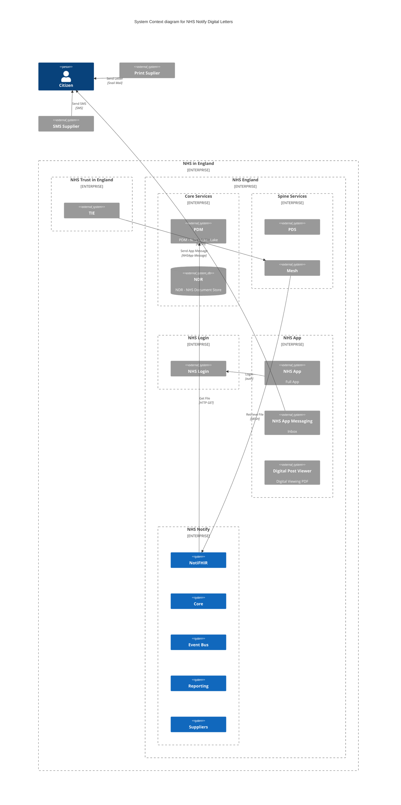

```mermaid
    C4Context
      title System Context diagram for NHS Notify Digital Letters
      Person(citizen01, "Citizen")

      Enterprise_Boundary(b1, "NHS in England") {
         Enterprise_Boundary(b3, "NHS Trust in England") {
           System_Ext(tie01, "TIE")
         }

      Enterprise_Boundary(b0, "NHS England") {

        Enterprise_Boundary(nhse01, "Core Services"){
           System_Ext(pdm01, "PDM", "PDM - NHS Health Lake")
           SystemDb_Ext(ndr01, "NDR", "NDR - NHS Document Store")
        }

        Enterprise_Boundary(nhse03, "Spine Services"){
           System_Ext(pds01, "PDS")
           System_Ext(mesh01, "Mesh")
        }

        Enterprise_Boundary(nhse04, "NHS Login"){
           System_Ext(login01, "NHS Login")
        }

        Enterprise_Boundary(nhse02, "NHS App"){
           System_Ext(nhsapp03, "NHS App", "Full App")
           System_Ext(nhsapp01, "NHS App Messaging", "Inbox")
           System_Ext(nhsapp02, "Digital Post Viewer", "Digital Viewing PDF")
        }


        Enterprise_Boundary(notify01, "NHS Notify") {
          System(notify02, "NotiFHIR")
          System(notify03, "Core")
          System(notify04, "Event Bus")
          System(notify05, "Reporting")
          System(notify06, "Suppliers")

        }
      }
      }

      System_Ext(print01, "Print Suplier")
      System_Ext(sms01, "SMS Supplier")

      Rel(tie01, mesh01, "Submits File", "MESH")
      Rel(mesh01, notify02, "Retrieve File", "MESH")

      Rel(print01, citizen01, "Send Letter", "Snail Mail")
      Rel(nhsapp01, citizen01, "Send App Message", "NHSApp Message")
      Rel(sms01, citizen01, "Send SMS", "SMS")

      Rel(nhsapp03, login01, "Login", "auth")

      Rel(notify02, pdm01, "Save File", "HTTP POST")
      Rel(notify02, pdm01, "Get File", "HTTP GET")


```
