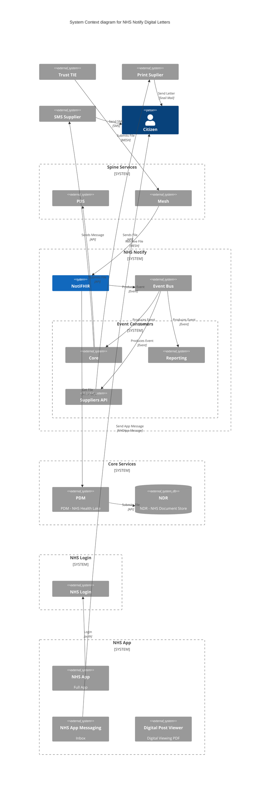

```mermaid
    C4Context
      title System Context diagram for NHS Notify Digital Letters
      System_Ext(tie01, "Trust TIE")
      System_Ext(print01, "Print Suplier")
      System_Ext(sms01, "SMS Supplier")
      Person(citizen01, "Citizen")


         System_Boundary(nhse03, "Spine Services"){
           System_Ext(pds01, "PDS")
           System_Ext(mesh01, "Mesh")
         }

       System_Boundary(notify01, "NHS Notify") {
          System(notify02, "NotiFHIR")
          System_Ext(notify04, "Event Bus")
          System_Boundary(notify01asd, "Event Consumers") {
          System_Ext(notify03, "Core")
          System_Ext(notify05, "Reporting")
          System_Ext(notify06, "Suppliers API")
          }
        }


        System_Boundary(nhse01, "Core Services"){
           System_Ext(pdm01, "PDM", "PDM - NHS Health Lake")
           SystemDb_Ext(ndr01, "NDR", "NDR - NHS Document Store")
        }

        System_Boundary(nhse04, "NHS Login"){
           System_Ext(login01, "NHS Login")
        }

        System_Boundary(nhse02, "NHS App"){
           System_Ext(nhsapp03, "NHS App", "Full App")
           System_Ext(nhsapp01, "NHS App Messaging", "Inbox")
           System_Ext(nhsapp02, "Digital Post Viewer", "Digital Viewing PDF")
        }


      Rel(tie01, mesh01, "Submits File", "MESH")
      Rel(mesh01, notify02, "Retrieve File", "MESH")

      Rel(print01, citizen01, "Send Letter", "Snail Mail")
      Rel(nhsapp01, citizen01, "Send App Message", "NHSApp Message")
      Rel(sms01, citizen01, "Send SMS", "SMS")

      Rel(nhsapp03, login01, "Login", "auth")

      Rel(notify02, pdm01, "Save File", "HTTP POST")
      Rel(notify02, pdm01, "Get File", "HTTP GET")

      Rel(pdm01, ndr01, "Submits File", "API")
      Rel(notify03, pds01, "Submits File", "API")
      Rel(notify02, notify04, "Produces Event", "Event")
      Rel(notify04, notify03, "Produces Event", "Event")
      Rel(notify04, notify05, "Produces Event", "Event")
      Rel(notify04, notify06, "Produces Event", "Event")

      Rel(notify06, print01, "Sends File", "API")
      Rel(notify03, sms01, "Sends Message", "API")
      UpdateLayoutConfig($c4ShapeInRow="8", $c4BoundaryInRow="1")


```
