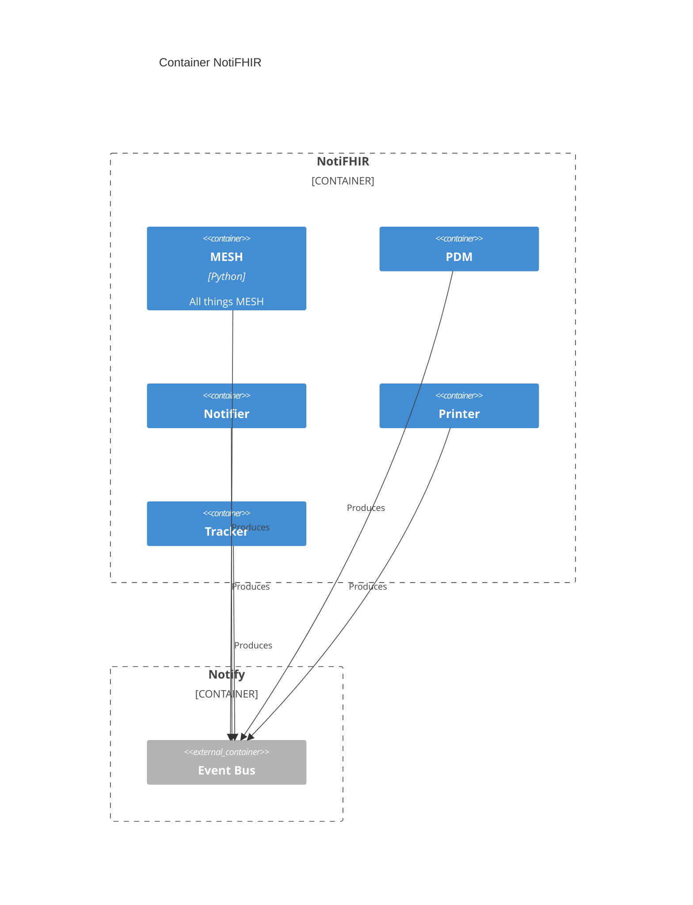

```mermaid
    C4Container
      title Container NotiFHIR

        Container_Boundary(notify01, "NotiFHIR") {
          Container(notify02, "MESH", "Python", "All things MESH", $tags="v1.0", $link="https://www.google.com")
          Container(notify04, "PDM")
          Container(notify03, "Notifier", $link="https://www.google.com")
          Container(notify05, "Printer")
          Container(notify06, "Tracker")
        }


        Container_Boundary(core, "Notify") {
          Container_Ext(eventbus, "Event Bus")

        }

        Rel(notify02, eventbus, "Produces")
        Rel(notify03, eventbus, "Produces")
        Rel(notify04, eventbus, "Produces")
        Rel(notify05, eventbus, "Produces")
        Rel(notify06, eventbus, "Produces")


        %%UpdateElementStyle(core, $fontColor="red", $bgColor="grey", $borderColor="red")
        %%UpdateRelStyle(notify02, eventbus, $offsetY="0", $offsetX="10")
        UpdateLayoutConfig($c4ShapeInRow="3", $c4BoundaryInRow="1")
```
