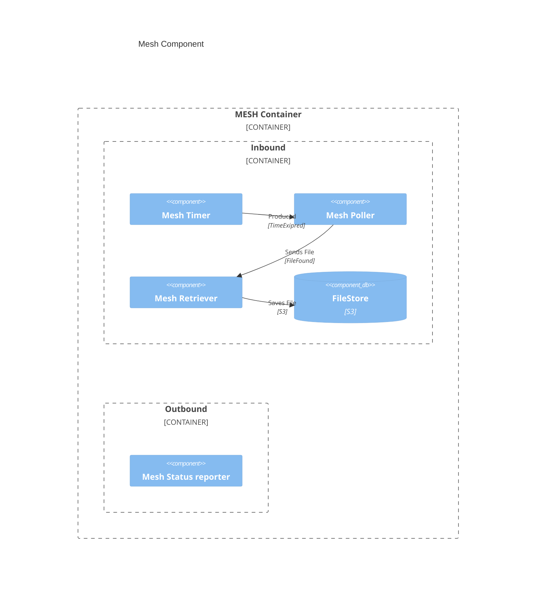
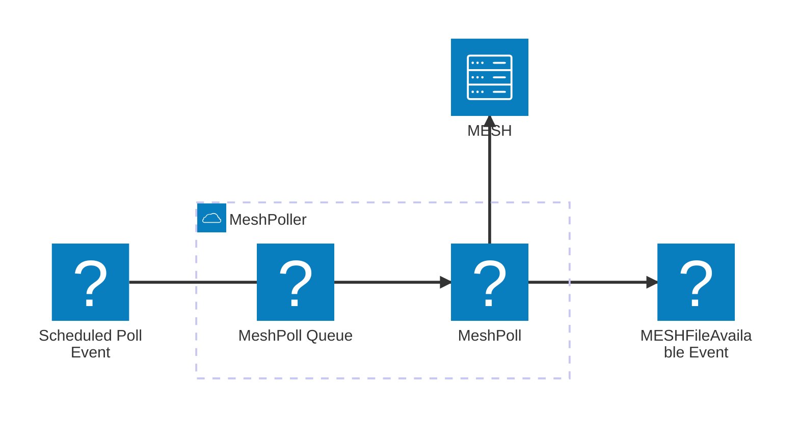
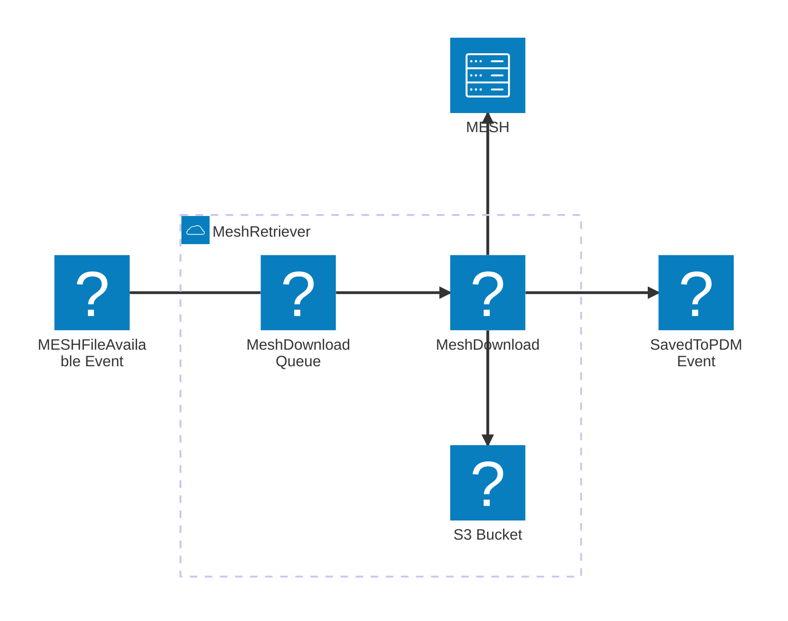

## MESH Poller

```mermaid
    C4Component
    title Mesh Component
    Container_Boundary(meshcontainer, "MESH Container") {

        Container_Boundary(inbound, "Inbound"){
         Component(timer, "Mesh Timer")
         Component(poller, "Mesh Poller")
         Component(retriever, "Mesh Retriever")
         ComponentDb(db, "FileStore", "S3", "")
        }


        Container_Boundary(outbound, "Outbound"){
         Component(reporter, "Mesh Status reporter")
        }

        Rel(timer, poller, "Produced", "TimeExipred")
        Rel(poller, retriever, "Sends File", "FileFound")
        Rel(retriever, db, "Saves File", "S3")


         UpdateLayoutConfig($c4ShapeInRow="3", $c4BoundaryInRow="1")
    }
```

Move below both to c4 code pages, nested below

```mermaid
architecture-beta
    group meshPoller(cloud)[MeshPoller]
    service meshDownloaded(logos:aws-eventbridge)[Scheduled Poll Event]
    service pdmSaved(logos:aws-eventbridge)[MESHFileAvailable Event]
    service meshPollQueue(logos:aws-sqs)[MeshPoll Queue] in meshPoller
    service meshPollLambda(logos:aws-lambda)[MeshPoll] in meshPoller
    service mesh(server)[MESH]


    meshDownloaded:R -- L:meshPollQueue
    meshPollQueue:R --> L:meshPollLambda
    meshPollLambda:T --> B:mesh
    meshPollLambda:R --> L:pdmSaved
```

## MESH Retriever

```mermaid
architecture-beta
    group meshRetriever(cloud)[MeshRetriever]
    service meshDownloaded(logos:aws-eventbridge)[MESHFileAvailable Event]
    service pdmSaved(logos:aws-eventbridge)[SavedToPDM Event]
    service meshDownloadQueue(logos:aws-sqs)[MeshDownload Queue] in meshRetriever
    service meshDownloadLambda(logos:aws-lambda)[MeshDownload] in meshRetriever
    service mesh(server)[MESH]
    service s3(logos:aws-s3)[S3 Bucket] in meshRetriever


    meshDownloaded:R -- L:meshDownloadQueue
    meshDownloadQueue:R --> L:meshDownloadLambda
    meshDownloadLambda:T --> B:mesh
    meshDownloadLambda:B --> T:s3
    meshDownloadLambda:R --> L:pdmSaved
```
