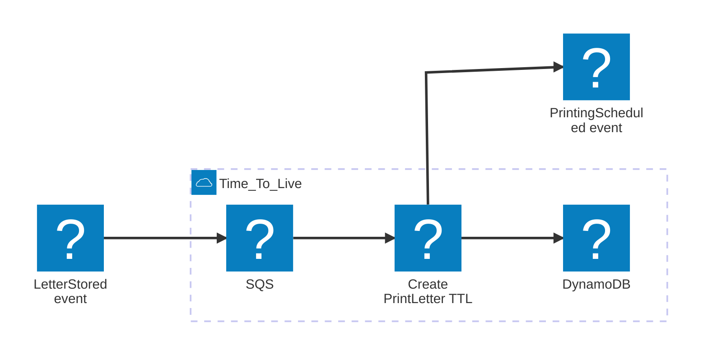

```mermaid
   architecture-beta
    group createTtl(cloud)[Time_To_Live]

    service db(logos:aws-dynamodb)[DynamoDB] in createTtl
    service createLambda(logos:aws-lambda)[Create PrintLetter TTL] in createTtl
    service queue(logos:aws-sqs)[SQS] in createTtl
    service storedEvent(aws:res-amazon-eventbridge-event)[LetterStored event]
    service scheduledEvent(aws:res-amazon-eventbridge-event)[PrintingScheduled event]

    storedEvent:R --> L:queue
    queue:R --> L:createLambda
    createLambda:R --> L:db
    createLambda:T --> L:scheduledEvent
```
