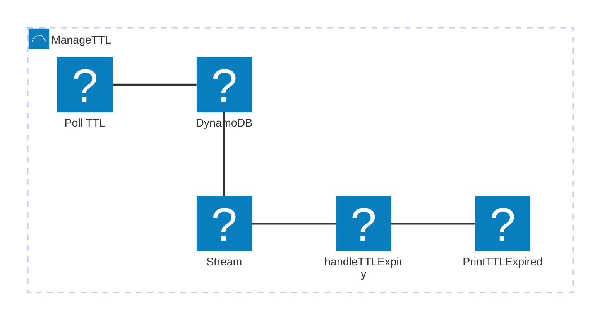

```mermaid
architecture-beta
   group manageTTL(cloud)[ManageTTL]
   service manageLambda(logos:aws-lambda)[Poll TTL] in manageTTL
   service manageDb(logos:aws-dynamodb)[DynamoDB] in manageTTL
   service ttlStream(logos:aws-stream)[Stream] in manageTTL
   service manageTtlExpiry(logos:aws-lambda)[handleTTLExpiry] in manageTTL
   service printTTLExpired(logos:aws-eventbridge)[PrintTTLExpired] in manageTTL

   manageLambda:R -- L:manageDb
   manageDb:B -- T:ttlStream
   ttlStream:R -- L:manageTtlExpiry
   manageTtlExpiry:R -- L:printTTLExpired
```
