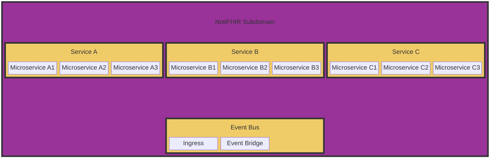

---

title: architecture-concepts
description: Architecture Concepts
---

```mermaid


block
block:subdom:1
    columns 3
    space:1
    notifhir["NotiFHIR Subdomain"]
    space:1
    block:b1:1
        columns 3
        space:1
        servicea["Service A"]
        space:1
        msa1["Microservice A1"]
        msa2["Microservice A2"]
        msa3["Microservice A3"]
    end
    block:b2:1
        columns 3
        space:1
        serviceb["Service B"]:1
        space:1
        msb1["Microservice B1"]
        msb2["Microservice B2"]
        msb3["Microservice B3"]
    end
    block:b3:1
        columns 3
        space:1
        servicec["Service C"]:1
        space:1
        msc1["Microservice C1"]
        msc2["Microservice C2"]
        msc3["Microservice C3"]
    end
    space:4
    block:b4:1
        columns 3
        space:1
        eb["Event Bus"]:1
        space:1
        eb1["Ingress"]
        eb2["Event Bridge"]

    end
end

    class b1 BT
    class b2 BT
    class b3 BT
    class b4 BT

    class servicea BT2
    class serviceb BT2
    class servicec BT2
    class eb BT2

    class subdom BT3
    class notifhir BT4

    classDef BT fill:#f0cc69,stroke:#333,stroke-width:4px
    classDef BT2 fill:#f0cc69,stroke:#333,stroke-width:0px
    classDef BT3 fill:#939,stroke:#333,stroke-width:4px
    classDef BT4 fill:#939,stroke:#333,stroke-width:0px


```
