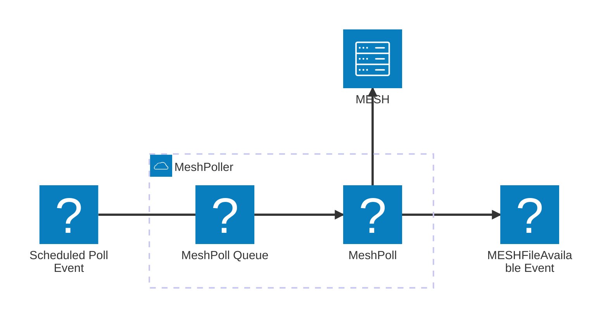

---

title: c4Component-notifhir-2

---

```mermaid
architecture-beta
    group meshPoller(cloud)[MeshPoller]
    service meshDownloaded(aws:res-amazon-eventbridge-event)[Scheduled Poll Event]
    service pdmSaved(aws:res-amazon-eventbridge-event)[MESHFileAvailable Event]
    service meshPollQueue(logos:aws-sqs)[MeshPoll Queue] in meshPoller
    service meshPollLambda(logos:aws-lambda)[MeshPoll] in meshPoller
    service mesh(server)[MESH]


    meshDownloaded:R -- L:meshPollQueue
    meshPollQueue:R --> L:meshPollLambda
    meshPollLambda:T --> B:mesh
    meshPollLambda:R --> L:pdmSaved
```
