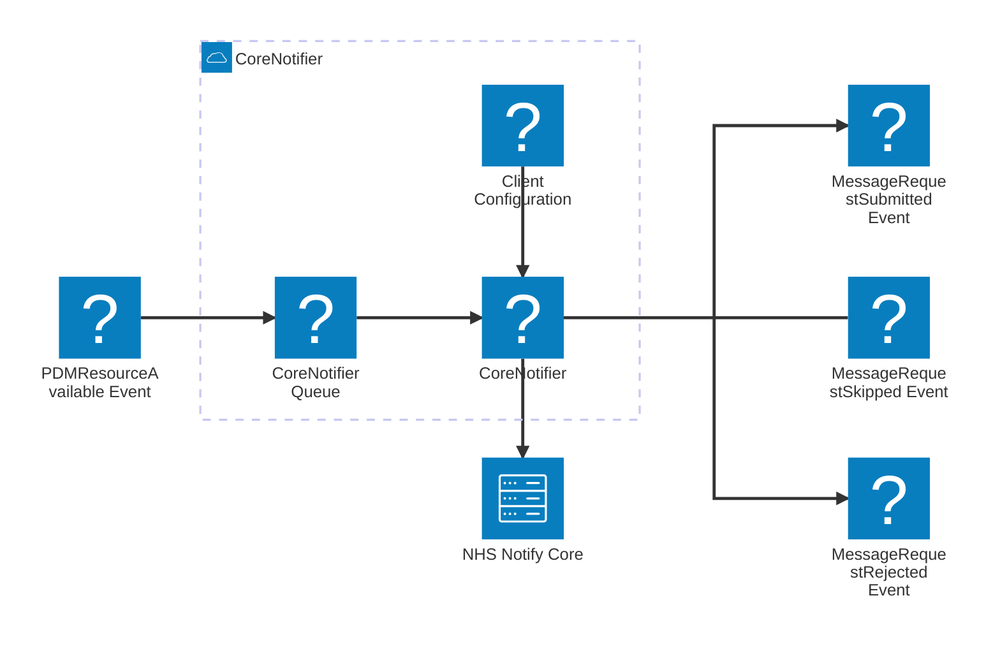

---

title: c4code-core-notifier

---

```mermaid
architecture-beta
    group coreNotifier(cloud)[CoreNotifier]
    service meshDownloaded(aws:res-amazon-eventbridge-event)[PDMResourceAvailable Event]
    service sqs(logos:aws-sqs)[CoreNotifier Queue] in coreNotifier
    service clientConfig(aws:res-aws-systems-manager-parameter-store)[Client Configuration] in coreNotifier
    service coreNotified(aws:res-amazon-eventbridge-event)[MessageRequestSubmitted Event]
    service coreFailed(aws:res-amazon-eventbridge-event)[MessageRequestRejected Event]
    service coreSkipped(aws:res-amazon-eventbridge-event)[MessageRequestSkipped Event]
    service notifier(logos:aws-lambda)[CoreNotifier] in coreNotifier
    service notify(server)[NHS Notify Core]
    junction j1

    meshDownloaded:R --> L:sqs
    sqs:R -->  L:notifier
    clientConfig:B --> T:notifier
    notifier:B --> T:notify
    notifier:R -- L:j1
    j1:T --> L:coreNotified
    j1:R -- L:coreSkipped
    j1:B --> L:coreFailed
```
