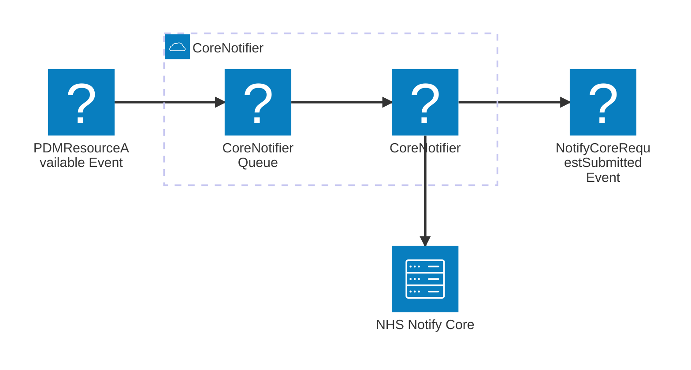

---

title: c4code-core-notifier

---

```mermaid
architecture-beta
    group coreNotifier(cloud)[CoreNotifier]
    service meshDownloaded(aws:res-amazon-eventbridge-event)[PDMResourceAvailable Event]
    service sqs(logos:aws-sqs)[CoreNotifier Queue] in coreNotifier
    service coreNotified(aws:res-amazon-eventbridge-event)[NotifyCoreRequestSubmitted Event]
    service notifier(logos:aws-lambda)[CoreNotifier] in coreNotifier
    service notify(server)[NHS Notify Core]

    meshDownloaded:R --> L:sqs
    sqs:R -->  L:notifier
    notifier:B --> T:notify
    notifier:R --> L:coreNotified
```
