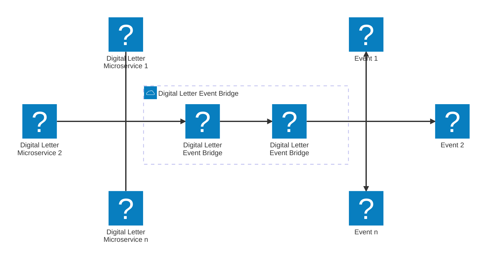

---

title: c4code-eventbus-eventbridge
description: Event Bridge
---

```mermaid
architecture-beta


    service ms1(logos:aws-lambda)[Digital Letter Microservice 1]
    service ms2(logos:aws-lambda)[Digital Letter Microservice 2]
    service msn(logos:aws-lambda)[Digital Letter Microservice n]

    group eb(cloud)[Digital Letter Event Bridge]
        service apigw(logos:aws-api-gateway)[Digital Letter Event Bridge] in eb
        service eventBridge(logos:aws-eventbridge)[Digital Letter Event Bridge] in eb

    service event1(aws:res-amazon-eventbridge-event)[Event 1]
    service event2(aws:res-amazon-eventbridge-event)[Event 2]
    service eventn(aws:res-amazon-eventbridge-event)[Event n]

    junction jn1
    junction jn2

    ms1:B -- T:jn1
    ms2:R -- L:jn1
    msn:T -- B:jn1
    jn1:R --> L:apigw

    apigw:R --> L:eventBridge
    eventBridge:R -- L:jn2
    jn2:T --> B:event1
    jn2:R --> L:event2
    jn2:B --> T:eventn

```
