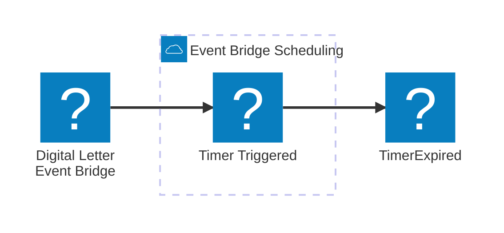

---

title: c4code-eventbus-timer
description: Event Bus Timer
---

```mermaid
architecture-beta
    service eventBridge(logos:aws-eventbridge)[Digital Letter Event Bridge]
    group timer(cloud)[Event Bridge Scheduling]
        service eventBridgeSchedule(aws:eventbridge-scheduler)[Timer Triggered] in timer
    service timerExpired(aws:res-amazon-eventbridge-event)[TimerExpired]


    eventBridge:R --> L:eventBridgeSchedule
    eventBridgeSchedule:R --> L:timerExpired

```
