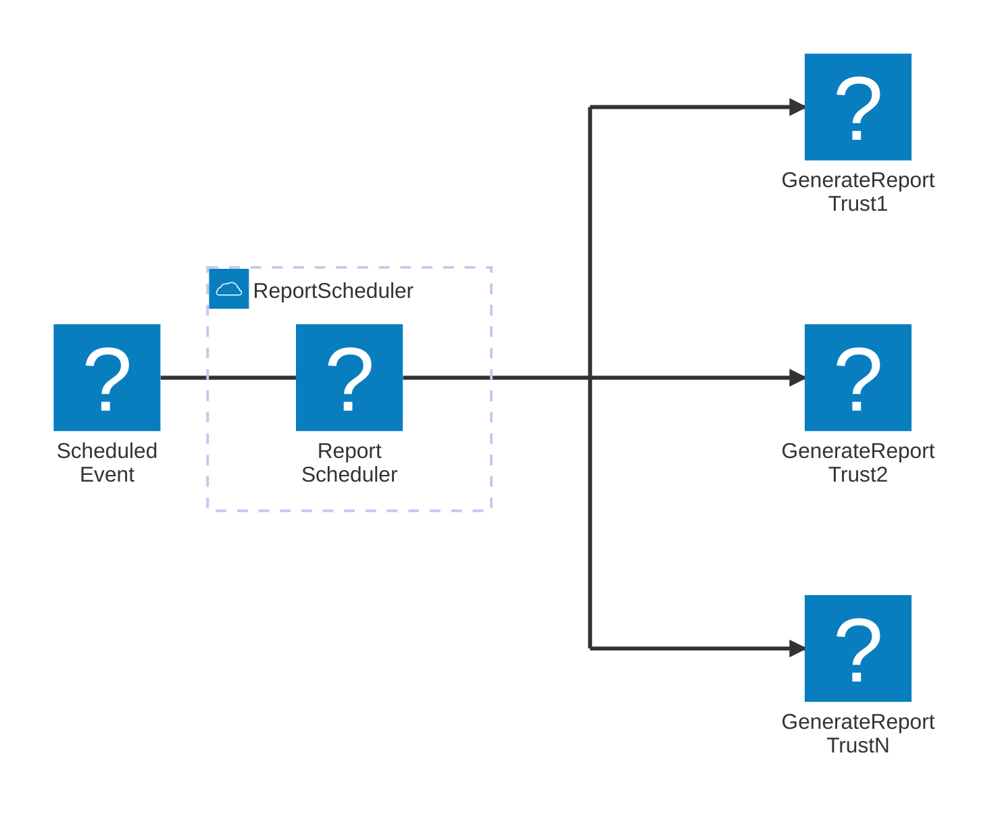

---

title: c4code-mesh-statusreporter-2

---

```mermaid
architecture-beta
    group reportScheduler(cloud)[ReportScheduler]
    service scheduledEvent(aws:res-amazon-eventbridge-event)[Scheduled Event]
    service reportSchedulerLambda(logos:aws-lambda)[Report Scheduler] in reportScheduler
    service report1Event(aws:res-amazon-eventbridge-event)[GenerateReport Trust1]
    service report2Event(aws:res-amazon-eventbridge-event)[GenerateReport Trust2]
    service report3Event(aws:res-amazon-eventbridge-event)[GenerateReport TrustN]
    junction j1
    junction j2
    junction j3

    scheduledEvent:R -- L:reportSchedulerLambda
    reportSchedulerLambda:R -- L:j1
    j1:T -- B:j2
    j1:B -- T:j3
    j2:R --> L:report1Event
    j1:R --> L:report2Event
    j3:R --> L:report3Event
```
