---

title: c4code-mesh-statusreporter-scheduler

---

## Decisions

1. ReportScheulder lambda publishes a `GenerateReport` event for each trust that has new report data in the previous 24 hours.
2. The event metadata contains the trust ID so the ReportGenerator lambda knows which trust to generate a report for.

```mermaid
architecture-beta
    group reportScheduler(cloud)[ReportScheduler]
    service scheduledEvent(aws:res-amazon-eventbridge-event)[Scheduled Event]
    service reportSchedulerLambda(logos:aws-lambda)[Report Scheduler] in reportScheduler
    service reportsdb(logos:aws-dynamodb)[Reports] in reportScheduler
    service report1Event(aws:res-amazon-eventbridge-event)[GenerateReport Trust1]
    service report2Event(aws:res-amazon-eventbridge-event)[GenerateReport Trust2]
    service report3Event(aws:res-amazon-eventbridge-event)[GenerateReport TrustN]
    junction j1
    junction j2
    junction j3

    scheduledEvent:R -- L:reportSchedulerLambda
    reportSchedulerLambda:T -- B:reportsdb
    reportSchedulerLambda:R -- L:j1
    j1:T -- B:j2
    j1:B -- T:j3
    j2:R --> L:report1Event
    j1:R --> L:report2Event
    j3:R --> L:report3Event
```

