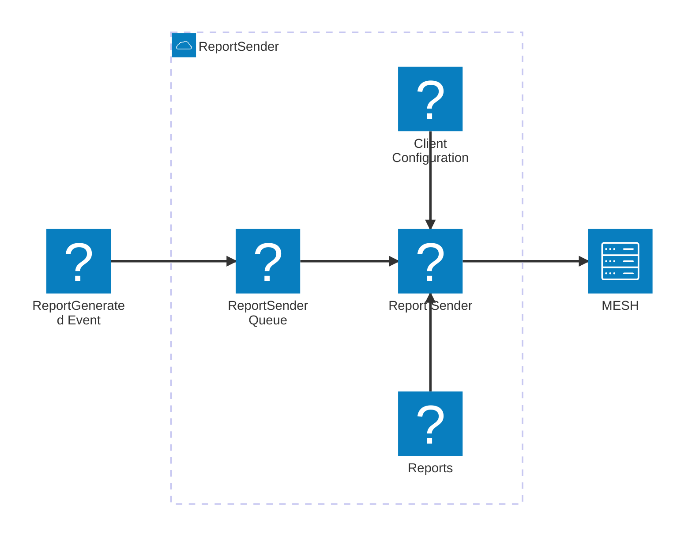

---

title: c4code-mesh-statusreporter-sender

---

```mermaid
architecture-beta
    group reportSender(cloud)[ReportSender]
    service reportGenerated(aws:res-amazon-eventbridge-event)[ReportGenerated Event]
    service sqs(logos:aws-sqs)[ReportSender Queue] in reportSender
    service clientConfig(aws:res-aws-systems-manager-parameter-store)[Client Configuration] in reportSender
    service reportSenderLambda(logos:aws-lambda)[Report Sender] in reportSender
    service s3(logos:aws-s3)[Reports] in reportSender
    service mesh(server)[MESH]

    reportGenerated:R --> L:sqs
    sqs:R --> L:reportSenderLambda
    clientConfig:B --> T:reportSenderLambda
    reportSenderLambda:B <-- T:s3
    reportSenderLambda:R --> L:mesh

```
