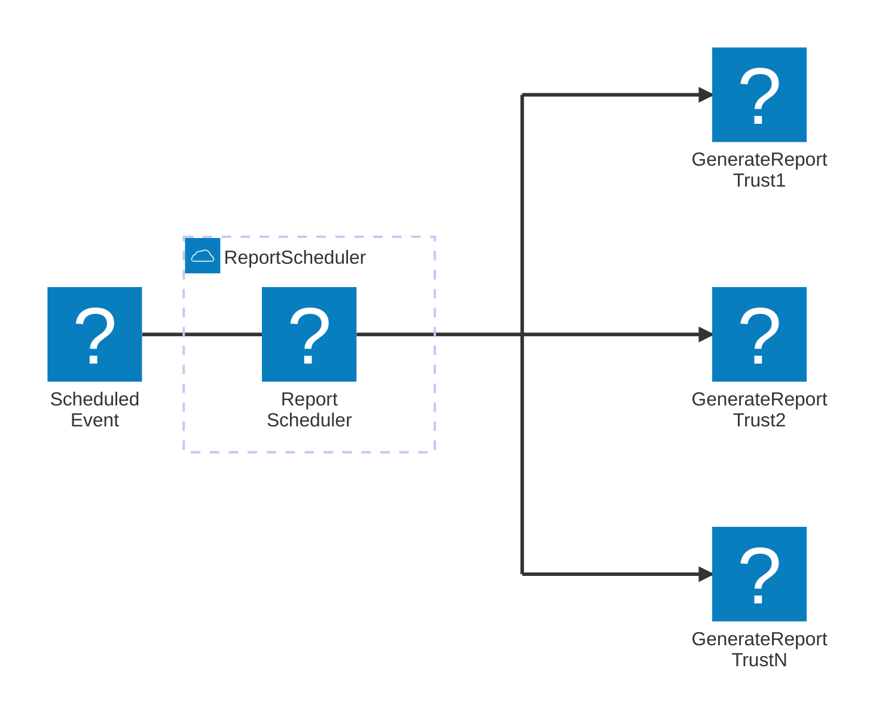
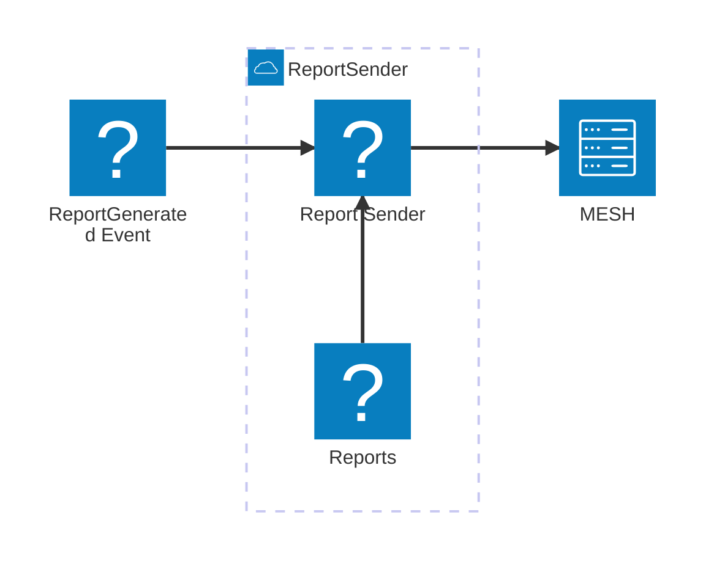

---

title: c4code-mesh-statusreporter

---

## Daily Status Report

### Report Scheduler

```mermaid
architecture-beta
    group reportScheduler(cloud)[ReportScheduler]
    service scheduledEvent(aws:res-amazon-eventbridge-event)[Scheduled Event]
    service reportSchedulerLambda(logos:aws-lambda)[Report Scheduler] in reportScheduler
    service report1Event(aws:res-amazon-eventbridge-event)[GenerateReport Trust1]
    service report2Event(aws:res-amazon-eventbridge-event)[GenerateReport Trust2]
    service report3Event(aws:res-amazon-eventbridge-event)[GenerateReport TrustN]
    junction j1
    junction j2
    junction j3

    scheduledEvent:R -- L:reportSchedulerLambda
    reportSchedulerLambda:R -- L:j1
    j1:T -- B:j2
    j1:B -- T:j3
    j2:R --> L:report1Event
    j1:R --> L:report2Event
    j3:R --> L:report3Event
```

### Report Sender

```mermaid
architecture-beta
    group reportSender(cloud)[ReportSender]
    service reportGenerated(aws:res-amazon-eventbridge-event)[ReportGenerated Event]
    service reportSenderLambda(logos:aws-lambda)[Report Sender] in reportSender
    service s3(logos:aws-s3)[Reports] in reportSender
    service mesh(server)[MESH]

    reportGenerated:R --> L:reportSenderLambda
    reportSenderLambda:B <-- T:s3
    reportSenderLambda:R --> L:mesh

```
