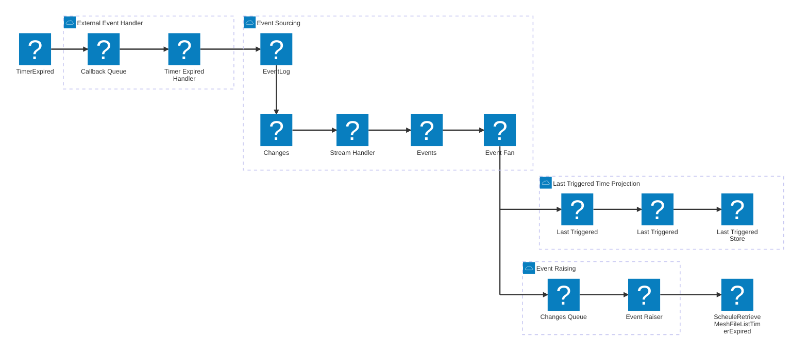

---

title: c4code-mesh-timer

---

```mermaid
architecture-beta
    service timerexpired(aws:res-amazon-eventbridge-event)[TimerExpired]


        group handler(cloud)[External Event Handler]
            service sqs(logos:aws-sqs)[Callback Queue] in handler
            service saveevent(logos:aws-lambda)[Timer Expired Handler] in handler

        group eventsource(cloud)[Event Sourcing]
            service eventlog(logos:aws-dynamodb)[EventLog] in eventsource
            service streamhandler(logos:aws-lambda)[Stream Handler] in eventsource
            service eventsourcestream(aws:res-amazon-dynamodb-stream)[Changes] in eventsource
            service sqsstream(logos:aws-sqs)[Events] in eventsource
            service sns(logos:aws-sns)[Event Fan] in eventsource

        group eventraising(cloud)[Event Raising]
            service sqschanges(logos:aws-sqs)[Changes Queue] in eventraising
            service raise(logos:aws-lambda)[Event Raiser] in eventraising

        junction j1
        junction j2

        group lasttriggeredprojection(cloud)[Last Triggered Time Projection]
            service sqschangeslasttriggered(logos:aws-sqs)[Last Triggered] in lasttriggeredprojection
            service lasttriggerlambda(logos:aws-lambda)[Last Triggered] in lasttriggeredprojection
            service lasttriggeredprojectionstore(logos:aws-dynamodb)[Last Triggered Store] in lasttriggeredprojection


    service meshtimerexpired(aws:res-amazon-eventbridge-event)[ScheuleRetrieveMeshFileListTimerExpired]

    timerexpired:R --> L:sqs

    sqs:R --> L:saveevent

    saveevent:R --> L:eventlog

    eventlog:B --> T:eventsourcestream
    eventsourcestream:R -->L:streamhandler
    streamhandler:R --> L:sqsstream
    sqsstream:R --> L:sns
    sns:B -- T:j1

    j1:B -- T:j2
    j2:R --> L:sqschanges
    sqschanges:R --> L:raise
    raise:R --> L:meshtimerexpired


    j1:R --> L:sqschangeslasttriggered
    sqschangeslasttriggered:R --> L:lasttriggerlambda
    lasttriggerlambda:R --> L:lasttriggeredprojectionstore
```
