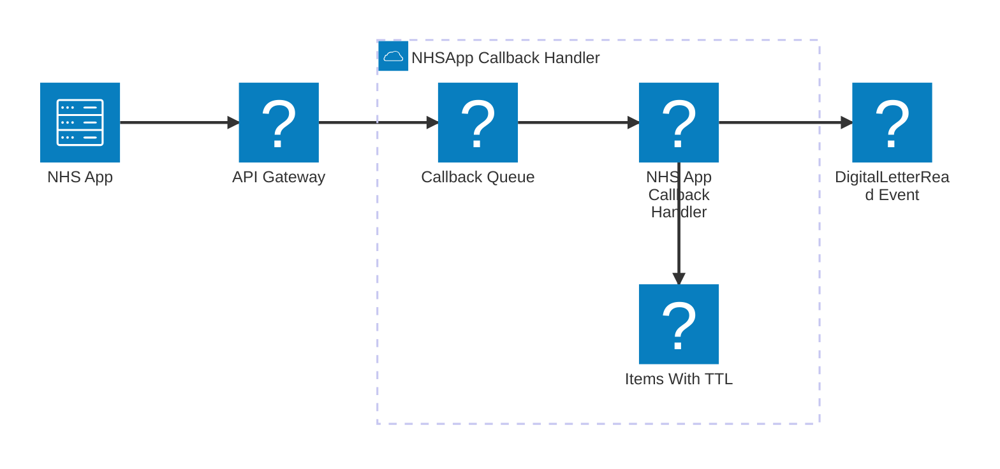

---

title: c4code-nhsapp-callback

---

```mermaid
architecture-beta
    group CallbackHandler(cloud)[NHSApp Callback Handler]
    service nhsapp(server)[NHS App]
    service apiGateway(aws:arch-amazon-api-gateway)[API Gateway]
    service lambda(logos:aws-lambda)[NHS App Callback Handler] in CallbackHandler
    service sqs(logos:aws-sqs)[Callback Queue] in CallbackHandler
    service ddb(logos:aws-dynamodb)[Items With TTL] in CallbackHandler
    service docReadEvent(aws:res-amazon-eventbridge-event)[DigitalLetterRead Event]

    nhsapp:R --> L:apiGateway
    apiGateway:R --> L:sqs
    sqs:R --> L:lambda
    lambda:B --> T:ddb
    lambda:R --> L:docReadEvent
```
