---

title: c4code-pdm-poller
description: PDM Poller
---

### Questions

1. What poll interval and duration is needed for the PDM Poller?

### Decisions

1. Use of an SQS Delay Queue to manage polling intervals
2. `PDMResourceUnavailable` event to contain retry count
3. PollPDM lambda to determine when max retries exceeded and emit a `PDMResourceRetriesExceeded` event

```mermaid
architecture-beta
    service pdmResourceSubmitted(aws:res-amazon-eventbridge-event)[PDMResourceSubmitted Event]
    service pdmResourceAvailable(aws:res-amazon-eventbridge-event)[PDMResourceAvailable Event]
    service pdmResourceUnavailable2(aws:res-amazon-eventbridge-event)[PDMResourceAvailable Event]
    service pdmRetriesExceeded(aws:res-amazon-eventbridge-event)[PDMResourceRetriesExceeded Event]
    service pdmResourceUnavailable(aws:res-amazon-eventbridge-event)[PDMResourceUnavailable Event]
    group checkPdm(cloud)[PDMPoller]
    service pollPdmQueue(logos:aws-sqs)[PollPDM SQS Delay Queue] in checkPdm
    service pollPdmLambda(logos:aws-lambda)[PollPDM] in checkPdm
    service pdm(server)[PDM]
    junction j1
    junction j2
    junction j3

    pdmResourceSubmitted:B -- T:j3
    pdmResourceUnavailable:T -- B:j3
    j3:R --> L:pollPdmQueue
    pollPdmQueue:R --> L:pollPdmLambda
    pollPdmLambda:R <--> L:pdm
    pollPdmLambda:B -- T:j1
    j1:R --> L:pdmResourceUnavailable2
    j1:B -- T:j2
    j2:R --> L:pdmResourceAvailable
    j2:B --> L:pdmRetriesExceeded

```

