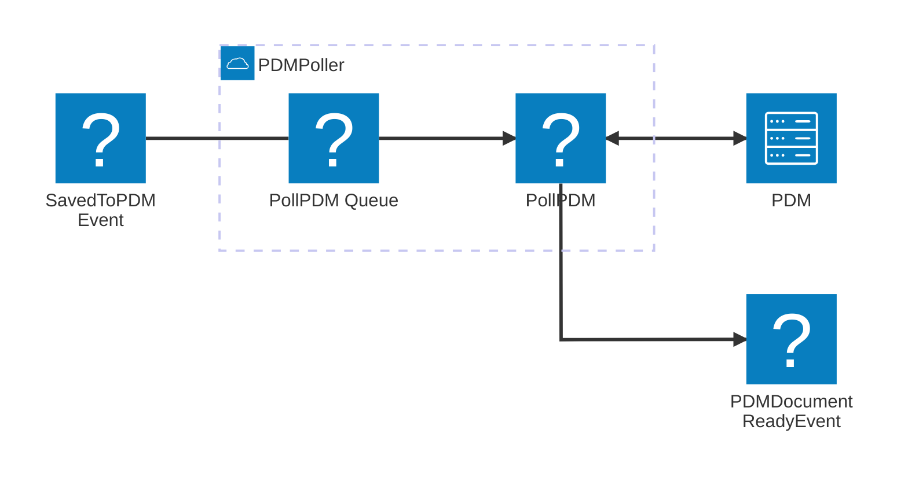

---

title: c4code-pdm-poller
description: PDM Poller
---

### Questions

1. What poll interval and duration is needed for the PDM Poller?
2. Can the polling be managed within the lambda?

```mermaid
architecture-beta
    service eventBus(aws:res-amazon-eventbridge-event)[SavedToPDM Event]
    service pdmReady(aws:res-amazon-eventbridge-event)[PDMDocumentReadyEvent]
    group checkPdm(cloud)[PDMPoller]
    service pollPdmQueue(logos:aws-sqs)[PollPDM Queue] in checkPdm
    service pollPdmLambda(logos:aws-lambda)[PollPDM] in checkPdm
    service pdm(server)[PDM]

    eventBus:R -- L:pollPdmQueue
    pollPdmQueue:R --> L:pollPdmLambda
    pollPdmLambda:B --> L:pdmReady
    pollPdmLambda:R <--> L:pdm
```
