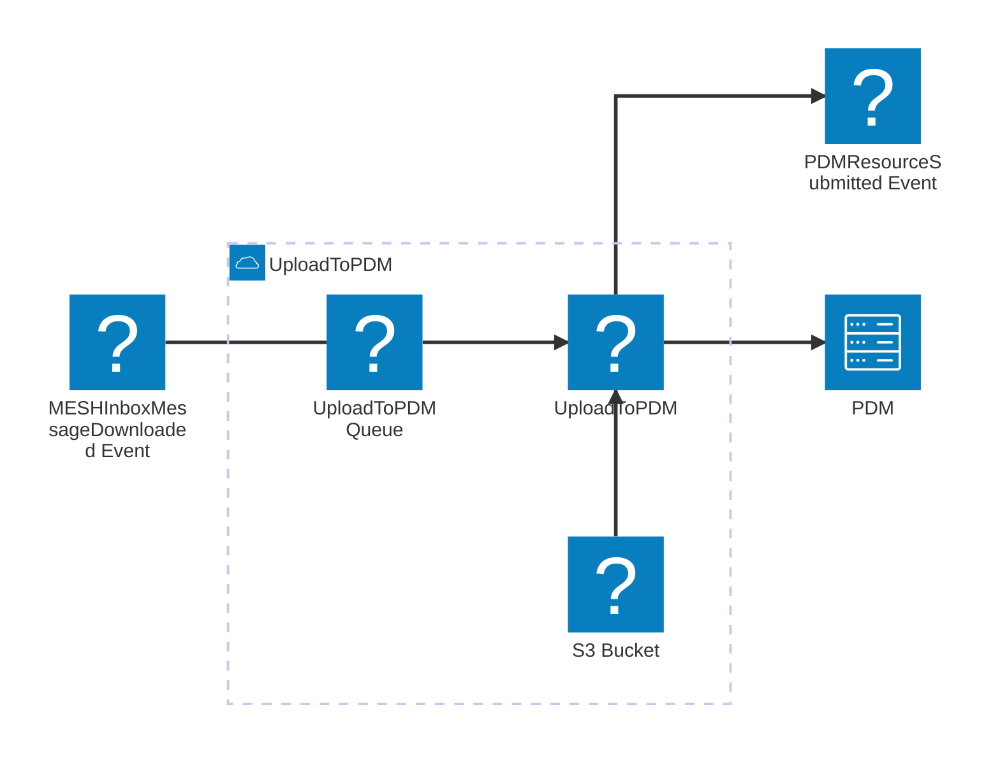

---

title: c4code-pdm-upload
description: PDM Upload
---

```mermaid
architecture-beta
    service meshDownloaded(aws:res-amazon-eventbridge-event)[MESHInboxMessageDownloaded Event]
    service pdmSaved(aws:res-amazon-eventbridge-event)[PDMResourceSubmitted Event]
    group uploadToPdm(cloud)[UploadToPDM]
    service uploadQueue(logos:aws-sqs)[UploadToPDM Queue] in uploadToPdm
    service uploadLambda(logos:aws-lambda)[UploadToPDM] in uploadToPdm
    service s3(logos:aws-s3)[S3 Bucket] in uploadToPdm
    service pdm(server)[PDM]


    meshDownloaded:R -- L:uploadQueue
    uploadQueue:R --> L:uploadLambda
    uploadLambda:B <-- T:s3
    uploadLambda:T --> L:pdmSaved
    uploadLambda:R --> L:pdm

```
