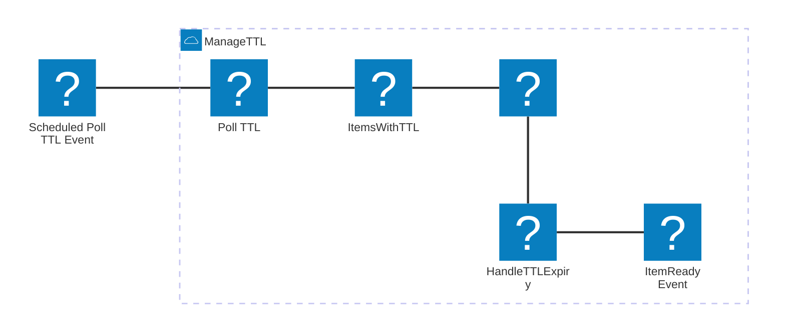

---

title: c4code-printer-removefromqueue
description: Manage TTL
---

```mermaid
architecture-beta
   group manageTTL(cloud)[ManageTTL]
   service pollEvent(aws:res-amazon-eventbridge-event)[Scheduled Poll TTL Event]
   service manageLambda(logos:aws-lambda)[Poll TTL] in manageTTL
   service manageDb(logos:aws-dynamodb)[ItemsWithTTL] in manageTTL
   service ttlStream(aws:res-amazon-dynamodb-stream) in manageTTL
   service manageTtlExpiry(logos:aws-lambda)[HandleTTLExpiry] in manageTTL
   service printTTLExpired(aws:res-amazon-eventbridge-event)[ItemReady Event] in manageTTL

   pollEvent:R -- L:manageLambda
   manageLambda:R -- L:manageDb
   manageDb:R -- L:ttlStream
   ttlStream:B -- T:manageTtlExpiry
   manageTtlExpiry:R -- L:printTTLExpired
```
