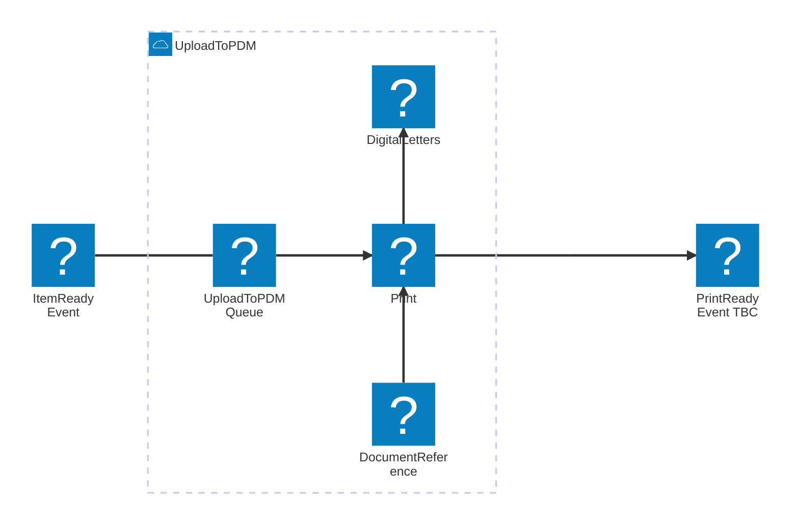

---

title: c4code-printer-sendtoprint

---

```mermaid
architecture-beta
    service itemReady(aws:res-amazon-eventbridge-event)[ItemReady Event]
    service printQueue(logos:aws-sqs)[UploadToPDM Queue] in sendToPrint
    service printLambda(logos:aws-lambda)[Print] in sendToPrint
    service docRefBucket(logos:aws-s3)[DocumentReference] in sendToPrint
    service digLtrsBucket(logos:aws-s3)[DigitalLetters] in sendToPrint
    service printEvent(aws:res-amazon-eventbridge-event)[PrintReady Event TBC]
    group sendToPrint(cloud)[UploadToPDM]
    junction j1


    itemReady:R -- L:printQueue
    printQueue:R --> L:printLambda
    printLambda:B <-- T:docRefBucket
    printLambda:T --> B:digLtrsBucket
    printLambda:R -- L:j1
    j1:R --> L:printEvent

```
