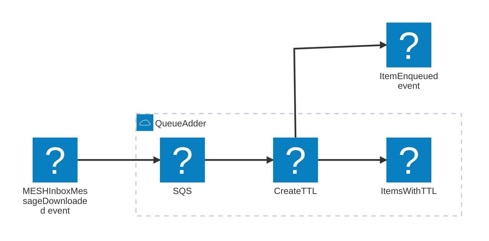

```mermaid
   architecture-beta
    group createTtl(cloud)[QueueAdder]

    service db(aws:arch-amazon-dynamodb)[ItemsWithTTL] in createTtl
    service createLambda(logos:aws-lambda)[CreateTTL] in createTtl
    service queue(logos:aws-sqs)[SQS] in createTtl
    service storedEvent(aws:res-amazon-eventbridge-event)[MESHInboxMessageDownloaded event]
    service scheduledEvent(aws:res-amazon-eventbridge-event) [ItemEnqueued event]

    storedEvent:R --> L:queue
    queue:R --> L:createLambda
    createLambda:R --> L:db
    createLambda:T --> L:scheduledEvent
```
