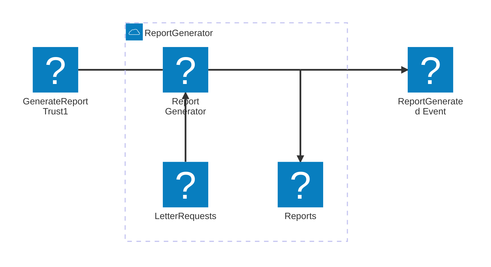

---

title: c4code-tracker-listener

---

```mermaid
architecture-beta
    group reportGenerator(cloud)[ReportGenerator]
    service report1Event(aws:res-amazon-eventbridge-event)[GenerateReport Trust1]
    service reportGenerated(aws:res-amazon-eventbridge-event)[ReportGenerated Event]
    service reportGeneratorLambda(logos:aws-lambda)[Report Generator] in reportGenerator
    service ddb(aws:arch-amazon-dynamodb)[LetterRequests] in reportGenerator
    service s3(logos:aws-s3)[Reports] in reportGenerator
    junction j1 in reportGenerator

    report1Event:R -- L:reportGeneratorLambda
    reportGeneratorLambda:B <-- T:ddb
    reportGeneratorLambda:R -- L:j1
    j1:B --> T:s3
    j1:R --> L:reportGenerated

```
