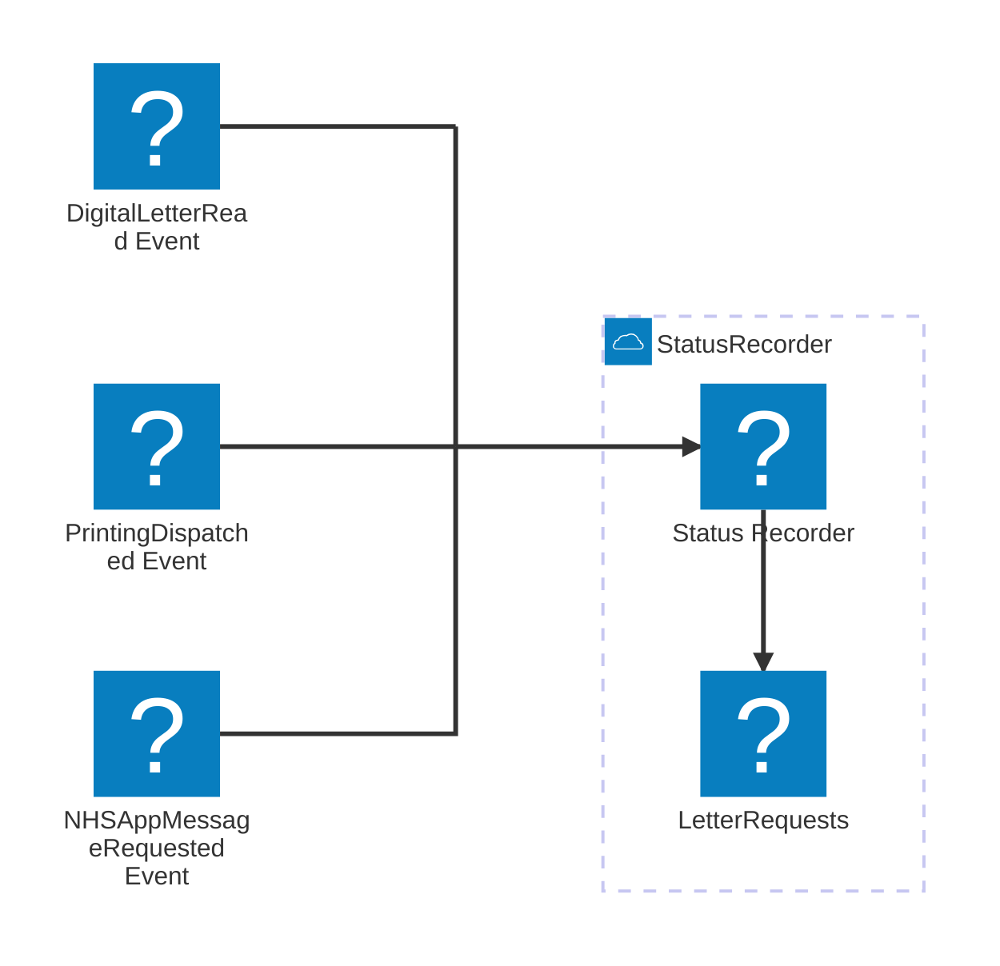

---

title: c4code-tracker-listener

---

```mermaid
architecture-beta
    group statusRecorder(cloud)[StatusRecorder]
    service report1Event(aws:res-amazon-eventbridge-event)[DigitalLetterRead Event]
    service report2Event(aws:res-amazon-eventbridge-event)[PrintingDispatched Event]
    service report3Event(aws:res-amazon-eventbridge-event)[NHSAppMessageRequested Event]
    service reportGeneratorLambda(logos:aws-lambda)[Status Recorder] in statusRecorder
    service ddb(aws:arch-amazon-dynamodb)[LetterRequests] in statusRecorder
    junction j1
    junction j2

    j2:B -- T:j1
    report1Event:R -- L:j2
    report2Event:R -- L:j1
    report3Event:R -- B:j1

    j1:R --> L:reportGeneratorLambda
    reportGeneratorLambda:B --> T:ddb

```
