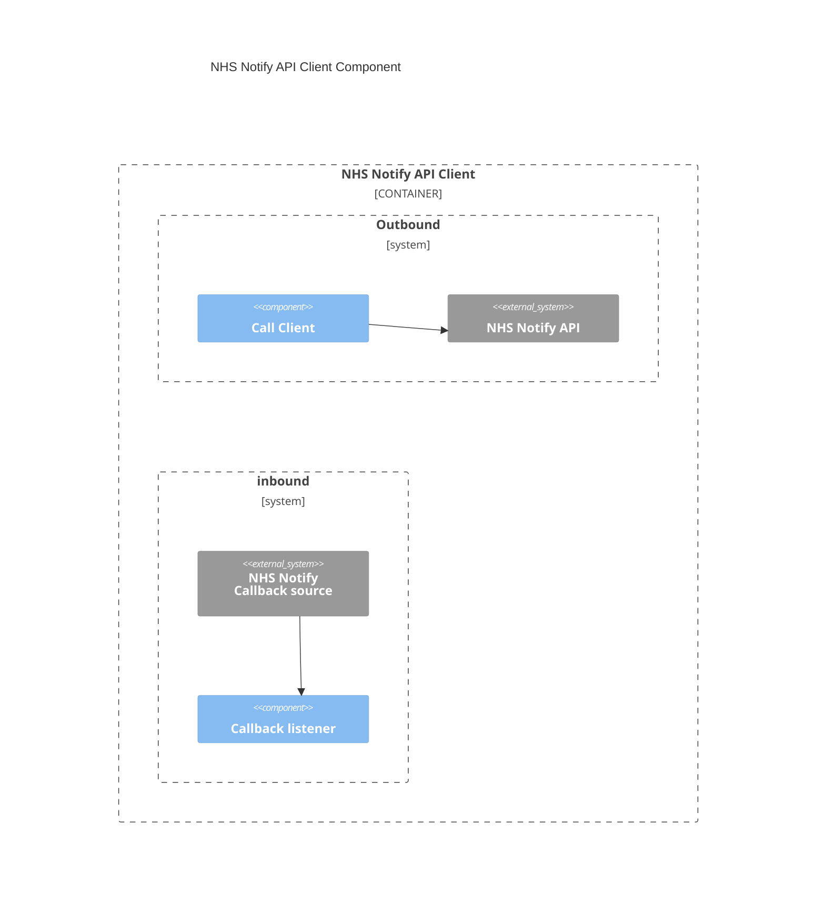

---

title: c4component-corenotifier

---

```mermaid
    C4Component
    title NHS Notify API Client  Component
    Container_Boundary(meshcontainer, "NHS Notify API Client") {

        Boundary(out, "Outbound"){
            Component(client, "Call Client")
            System_Ext(nhsnotifyapi, "NHS Notify API")
        }
        Boundary(in, "inbound"){
            System_Ext(nhsnotifyapicallbacks, "NHS Notify <br> Callback source")
            Component(listener, "Callback listener")
        }

        Rel(client, nhsnotifyapi, "", "")
        Rel(nhsnotifyapicallbacks, listener, "", "")

        UpdateLayoutConfig($c4ShapeInRow="3", $c4BoundaryInRow="1")


    }
```
