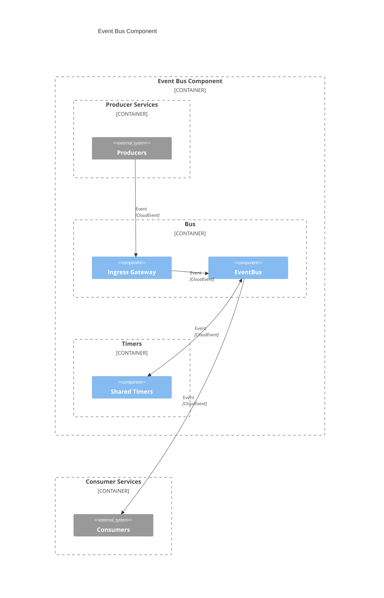

---

title: c4component-eventbus

---

```mermaid
    C4Component
    title Event Bus Component

    Container_Boundary(meshcontainer, "Event Bus Component") {

          Container_Boundary(prod, "Producer Services"){
             System_Ext(producers, "Producers")
          }
        Container_Boundary(bus, "Bus"){
            Component(apigw, "Ingress Gateway")
            Component(eb, "EventBus")
        }
         Container_Boundary(timers, "Timers"){
            Component(ebtimers, "Shared Timers")
        }
        Rel(apigw, eb, "Event", "CloudEvent")
        BiRel(eb, ebtimers, "Event", "CloudEvent")
        Rel(producers, apigw, "Event", "CloudEvent")
        Rel(eb, consumers, "Event", "CloudEvent")
    }

    Container_Boundary(con, "Consumer Services"){

        System_Ext(consumers, "Consumers")
    }

    UpdateLayoutConfig($c4ShapeInRow="3", $c4BoundaryInRow="1")
```
