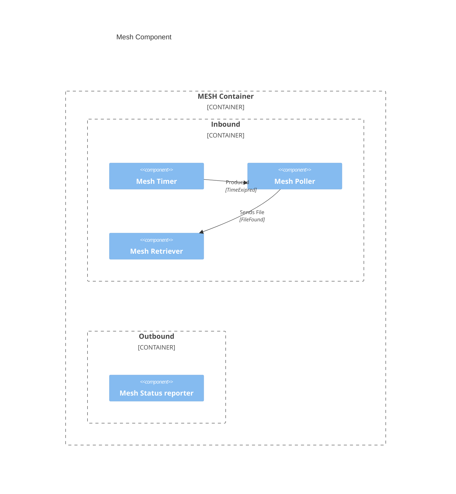

---

title: c4component-mesh

---

```mermaid
    C4Component
    title Mesh Component
    Container_Boundary(meshcontainer, "MESH Container") {

        Container_Boundary(inbound, "Inbound"){
         Component(timer, "Mesh Timer")
         Component(poller, "Mesh Poller")
         Component(retriever, "Mesh Retriever")
        }


        Container_Boundary(outbound, "Outbound"){
         Component(reporter, "Mesh Status reporter")
        }

        Rel(timer, poller, "Produced", "TimeExipred")
        Rel(poller, retriever, "Sends File", "FileFound")


         UpdateLayoutConfig($c4ShapeInRow="3", $c4BoundaryInRow="1")
    }
```
