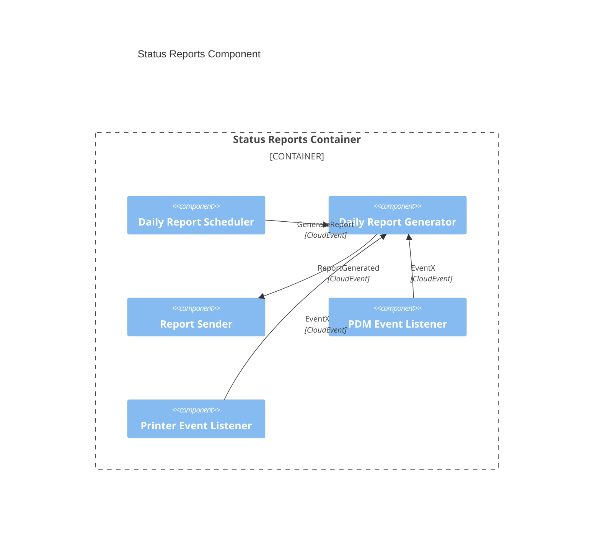

---

title: c4component-digtiallettertatusreports
description: Real time generation of status reports
c4type: code
---

```mermaid
    C4Component
    title Status Reports Component
    Container_Boundary(meshcontainer, "Status Reports Container") {

         Component(reportscheduler, "Daily Report Scheduler")
         Component(dailygenerator, "Daily Report Generator")
         Component(reportsender, "Report Sender")
         Component(pdmlistener, "PDM Event Listener")
         Component(printerlistener, "Printer Event Listener")


         Rel(reportscheduler, dailygenerator, "GenerateReport", "CloudEvent")
         Rel(dailygenerator, reportsender, "ReportGenerated", "CloudEvent")
         Rel(pdmlistener, dailygenerator, "EventX", "CloudEvent")
         Rel(printerlistener, dailygenerator, "EventX", "CloudEvent")

         UpdateLayoutConfig($c4ShapeInRow="2", $c4BoundaryInRow="1")


    }
```
