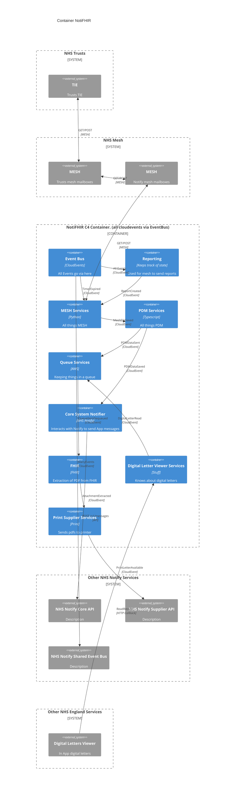

---

title: c4container-notifhir

---

```mermaid
    C4Context
      title Container NotiFHIR

      System_Boundary(trusts, "NHS Trusts")
      {
        System_Ext(trusttie, "TIE", "Trusts TIE")
      }

      System_Boundary(nhsmesh, "NHS Mesh")
      {
        System_Ext(trustmesh, "MESH", "Trusts mesh mailboxes")
        System_Ext(notifymesh, "MESH", "Notify mesh mailboxes")
      }

      Container_Boundary(notify01, "NotiFHIR C4 Container. (all cloudevents via EventBus)") {
        Container(eventbus, "Event Bus", "CloudEvents", "All Events go via here")
        Container(statetracking, "Reporting", "Keeps track of state", "Used for mesh to send reports")
        Container(mesh, "MESH Services", "Python", "All things MESH", $tags="v1.0", $link="https://www.google.com")
        Container(pdm, "PDM Services", "Typescript", "All things PDM")
        Container(ttl, "Queue Services", "AWS", "Keeping things in a queue")
        Container(core, "Core System Notifier", "NHS Notify", "Interacts with Notify to send App messages", $link="https://www.google.com")
        Container(fhir, "FHIR", "FHIR", "Extraction of PDF from FHIR")
        Container(digitalletter, "Digital Letter Viewer Services", "Stuff", "Knows about digital letters")

        Container(print, "Print Supplier Services", "Print", "Sends pdfs to printer")

      }

      System_Boundary(othernotifyservices, "Other NHS Notify Services")
      {

          System_Ext(notifycore, "NHS Notify Core API", "Description")
         System_Ext(notifysupplierapi, "NHS Notify Supplier API", "Description")
         System_Ext(notifyeventbus, "NHS Notify Shared Event Bus", "Description")
      }

      System_Boundary(otherservices, "Other NHS England Services")
      {
        System_Ext(digitalletterssystem, "Digital Letters Viewer", "In App digital letters")
      }

      BiRel(trusttie, trustmesh, "GET/POST", "MESH")

      BiRel(trustmesh, notifymesh, "GET/POST", "MESH")

      BiRel(mesh, notifymesh, "GET/POST", "MESH")

      Rel(mesh, pdm, "MeshFileSaved", "CloudEvent")
      Rel(pdm, ttl, "PDMDataSent", "CloudEvent")
      Rel(pdm, core, "PDMDataSaved", "CloudEvent")
      Rel(ttl, fhir, "QueueItemDequeued", "CloudEvent")
      Rel(fhir, print, "AttachmentExtracted", "CloudEvent")
      Rel(digitalletter, ttl, "DigitalLetterRead", "CloudEvent")
      Rel(digitalletterssystem, digitalletter, "ReadReceipt", "HTTP Callback")
      Rel(eventbus, statetracking, "All Events", "CloudEvent")
      Rel(statetracking, mesh, "ReportCreated", "CloudEvent")
      Rel(core, notifycore,  "POST /v1/messages", "API")
      Rel(eventbus, mesh,  "TimerExpired", "CloudEvent")

      Rel(print, notifysupplierapi,  "PrintLetterAvailable", "CloudEvent")
      Rel(eventbus, notifyeventbus,  "ManyEvents", "CloudEvent")

      UpdateLayoutConfig($c4ShapeInRow="3", $c4BoundaryInRow="1")

```
