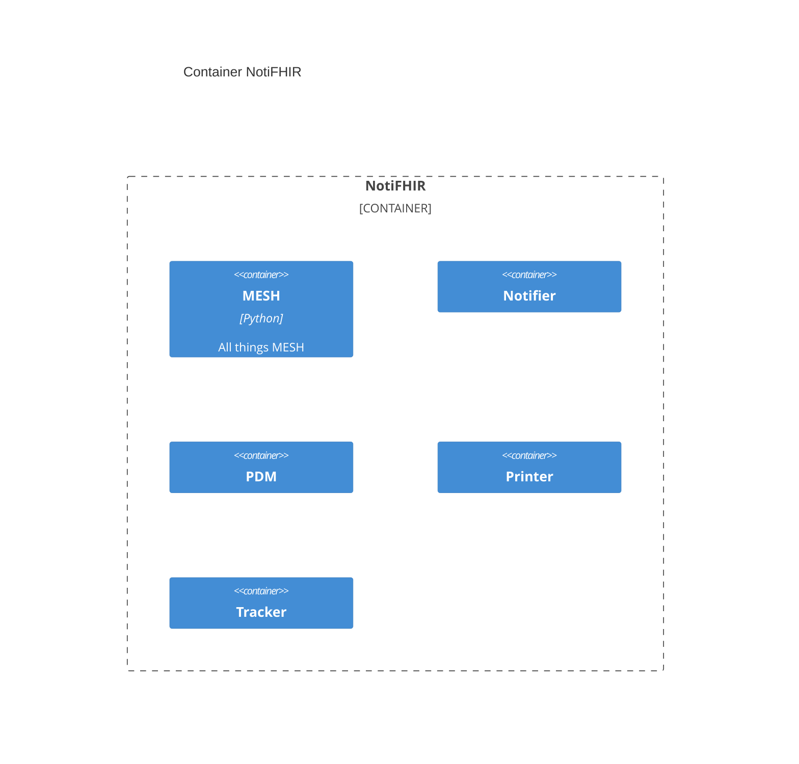

---

title: c4container

---

```mermaid
    C4Context
      title Container NotiFHIR

        Container_Boundary(notify01, "NotiFHIR") {
          Container(notify02, "MESH", "Python", "All things MESH", $tags="v1.0", $link="https://www.google.com")
          Container(notify03, "Notifier", $link="https://www.google.com")
          Container(notify04, "PDM")
          Container(notify05, "Printer")
          Container(notify06, "Tracker")


        }


```
