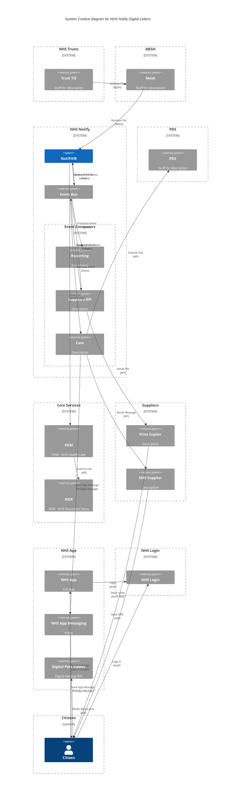

```mermaid
    C4Context
      title System Context diagram for NHS Notify Digital Letters

      System_Boundary(trusts, "NHS Trusts"){
         System_Ext(tie01, "Trust TIE", "Stuff for description")
      }

      System_Boundary(nhse03, "MESH "){
         System_Ext(mesh01, "Mesh", "Stuff for description")
      }

      System_Boundary(notify01, "NHS Notify") {
         System(notify02, "NotiFHIR")
         System_Ext(notify04, "Event Bus")
         System_Boundary(notify01asd, "Event Consumers") {

            System_Ext(notify05, "Reporting", "Description")
            System_Ext(notify06, "Suppliers API", "Description")
            System_Ext(notify03, "Core", "Description")
         }
      }

      System_Boundary(pdssystem, "PDS"){
         System_Ext(pds01, "PDS", "Stuff for description")
      }

      System_Boundary(nhse01, "Core Services"){
         System_Ext(pdm01, "PDM", "PDM - NHS Health Lake", "Description")
         System_Ext(ndr01, "NDR", "NDR - NHS Document Store", "Description")
      }

      System_Boundary(suppliers, "Suppliers", "Description"){
         System_Ext(print01, "Print Suplier", "Description")
         System_Ext(sms01, "SMS Supplier", "Description")
      }

      System_Boundary(nhse02, "NHS App", "Description"){
         System_Ext(nhsapp03, "NHS App", "Full App")
         System_Ext(nhsapp01, "NHS App Messaging", "Inbox")
         System_Ext(nhsapp02, "Digital Post Viewer", "Digital Viewing PDF")
      }


      System_Boundary(nhse04, "NHS Login"){
         System_Ext(login01, "NHS Login")
      }

    Boundary(people, "Citizens"){
         Person(citizen01, "Citizen")
      }


      Rel(citizen01, login01, "Logs in", "auth")
      Rel(citizen01, nhsapp02, "Reads digital post", "pdf")
      Rel(citizen01, nhsapp03, "Reads message", "app messsage")
      Rel(mesh01, notify02, "Retrieve File", "MESH")
      Rel(nhsapp01, citizen01, "Send App Message", "NHSApp Message")
      Rel(nhsapp03, login01, "Login", "auth")
      Rel(notify02, notify04, "Produces Event", "Event")
      Rel(notify02, pdm01, "Get File", "HTTP GET")
      Rel(notify02, pdm01, "Save File", "HTTP POST")
      Rel(notify03, nhsapp01, "Send App Message", "NHSApp Message")
      Rel(notify03, pds01, "Submits File", "API")
      Rel(notify03, sms01, "Sends Message", "API")
      Rel(notify04, notify03, "Produces Event", "Event")
      Rel(notify04, notify05, "Produces Event", "Event")
      Rel(notify04, notify06, "Produces Event", "Event")
      Rel(notify06, print01, "Sends File", "API")
      Rel(pdm01, ndr01, "Submits File", "API")
      Rel(print01, citizen01, "Send Letter", "Snail Mail")
      Rel(sms01, citizen01, "Send SMS", "SMS")
      Rel(tie01, mesh01, "Submits File", "MESH")
      Rel(notify06, notify04, "Update Print Status", "Event")
      Rel(notify04, notify02, "Update Print Status", "Event")

      UpdateLayoutConfig($c4ShapeInRow="3", $c4BoundaryInRow="2")


```
