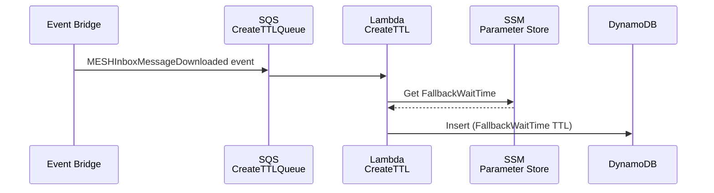

---

title: sequence-create-print-ttl

---

```mermaid
sequenceDiagram
  participant eb as Event Bridge
  participant sqs as SQS<br/>CreateTTLQueue
  participant createTTL as Lambda<br/>CreateTTL
  participant ssm as SSM<br/>Parameter Store
  participant dynamo as DynamoDB


  eb ->> sqs: MESHInboxMessageDownloaded event
  sqs ->> createTTL:
  createTTL ->> ssm: Get FallbackWaitTime
  ssm -->> createTTL:
  createTTL ->> dynamo: Insert (FallbackWaitTime TTL)
```
