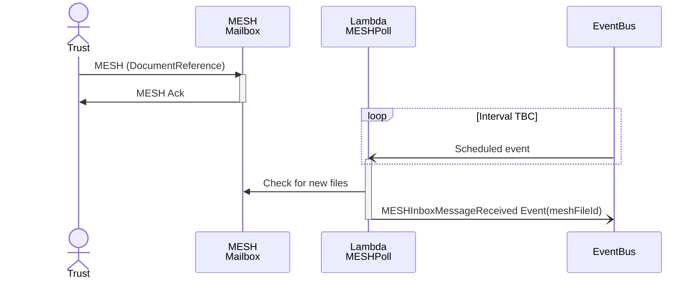

---

title: sequence-mesh-poller

---

```mermaid

sequenceDiagram
  actor trust as Trust
  participant meshMailbox as MESH<br/>Mailbox
  participant meshPoll as Lambda<br/>MESHPoll
  participant eventBus as EventBus

  trust ->> meshMailbox: MESH (DocumentReference)
  activate meshMailbox
    meshMailbox ->> trust: MESH Ack
  deactivate meshMailbox

  Loop Interval TBC
    eventBus -) meshPoll: Scheduled event
    activate meshPoll
  end
  meshPoll ->> meshMailbox: Check for new files
  meshPoll -) eventBus: MESHInboxMessageReceived Event(meshFileId)
  deactivate meshPoll

```
