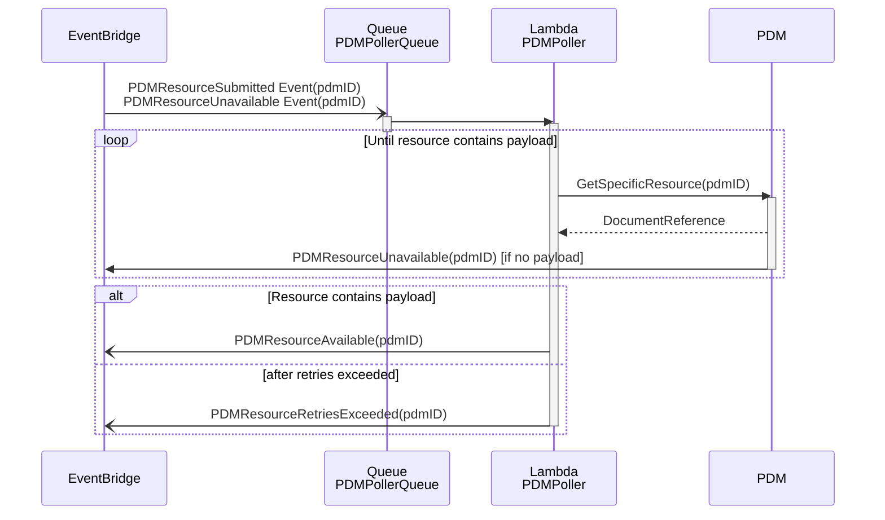

---

title: sequence-pdm-poller

---

```mermaid

sequenceDiagram
  participant eventBus as EventBridge
  participant pdmPollerQueue as Queue<br/>PDMPollerQueue
  participant pdmPoller as Lambda<br/>PDMPoller
  participant pdm as PDM

  eventBus -) pdmPollerQueue: PDMResourceSubmitted Event(pdmID)<br/>PDMResourceUnavailable Event(pdmID)
  activate pdmPollerQueue
  pdmPollerQueue ->> pdmPoller:
  deactivate pdmPollerQueue
  activate pdmPoller
  loop Until resource contains payload
    pdmPoller ->> pdm: GetSpecificResource(pdmID)
    activate pdm
    pdm -->> pdmPoller: DocumentReference
    pdm ->> eventBus: PDMResourceUnavailable(pdmID) [if no payload]
    deactivate pdm
  end
  alt Resource contains payload
  pdmPoller -) eventBus: PDMResourceAvailable(pdmID)
  else after retries exceeded
  pdmPoller -) eventBus: PDMResourceRetriesExceeded(pdmID)
  deactivate pdmPoller
  end
```
