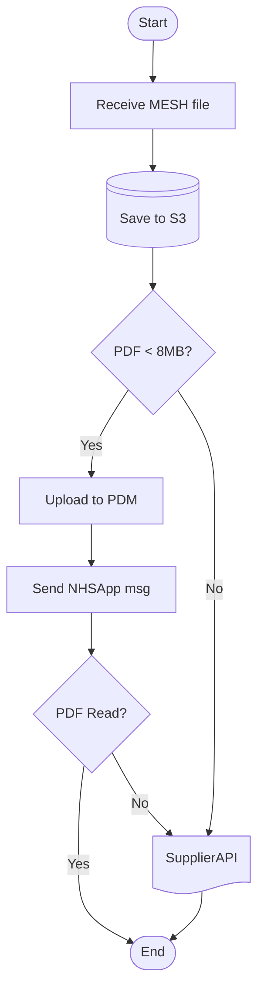

```mermaid

flowchart TD
        Start(["Start"])
        Start --> Mesh[Receive MESH file]
        Mesh --> S3@{shape: disk, label: "Save to S3"}
        S3 --> FileSize{"PDF < 8MB?"}
        FileSize -->|Yes| PDM["Upload to PDM"]
        FileSize -->|No| SupplierAPI@{shape: doc, label:"Send to SupplierAPI"}
        PDM --> NHSApp["Send NHSApp msg"]
        NHSApp --> PDFRead{"PDF Read?"}
        PDFRead -->|Yes| End(["End"])
        PDFRead -->|No| SupplierAPI
        SupplierAPI --> End
```
