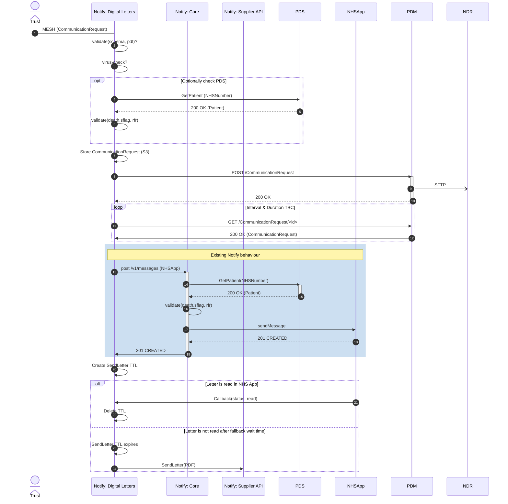

## Questions

- 1. Should we validate the CommunicationRequest schema?
- 2. (&14) This would result in two separate PDS hits
- 3. Should Notify virus check the payload given that files >10MB don't go to PDM/NDR
- 7. When does Notify delete its local copy?
- 11. Duration and interval of polling
- 21. Can NHSApp read callback go to notify-letters when the message request originated from notify-core?

