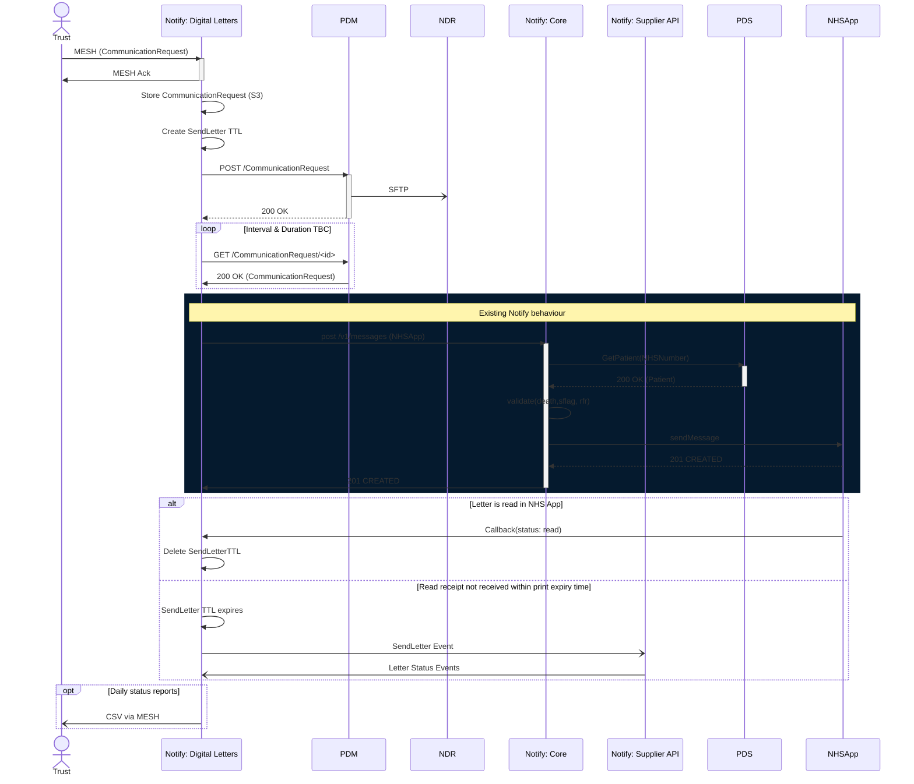

## Questions

1. When does Notify delete its local copy?
2. Duration and interval of polling
3. Can NHSApp read callback go to notify-letters when the message request originated from notify-core?

## Decisions

1. Out of scope for MVP: Virus checking of PDF received from Trust
2. Don't check `CommunicationRequest` filesize. Attempt to upload all `CommunicationRequest`s to PDM. Those exceeding APIM size limit will fail.
3. No PDS check by Digital Letters component of Date-of-Death, S-flag, RFR codes. Rely on Trusts having performed these checks.

