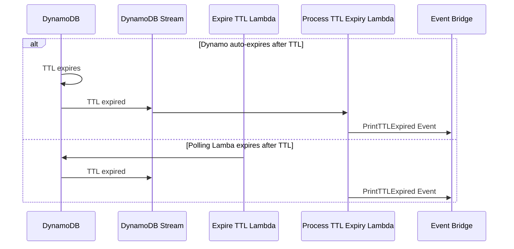

```mermaid
sequenceDiagram
  participant dynamo as DynamoDB
  participant stream as DynamoDB Stream
  participant expireTTL as Expire TTL Lambda
  participant processTTLExpiry as Process TTL Expiry Lambda
  participant eb as Event Bridge

  alt Dynamo auto-expires after TTL
    dynamo ->> dynamo: TTL expires
    dynamo ->> stream: TTL expired
    stream ->> processTTLExpiry:
    processTTLExpiry ->> eb: PrintTTLExpired Event
  else Polling Lamba expires after TTL
    expireTTL ->> dynamo:
    dynamo ->> stream: TTL expired
    processTTLExpiry ->> eb: PrintTTLExpired Event
  end
```
