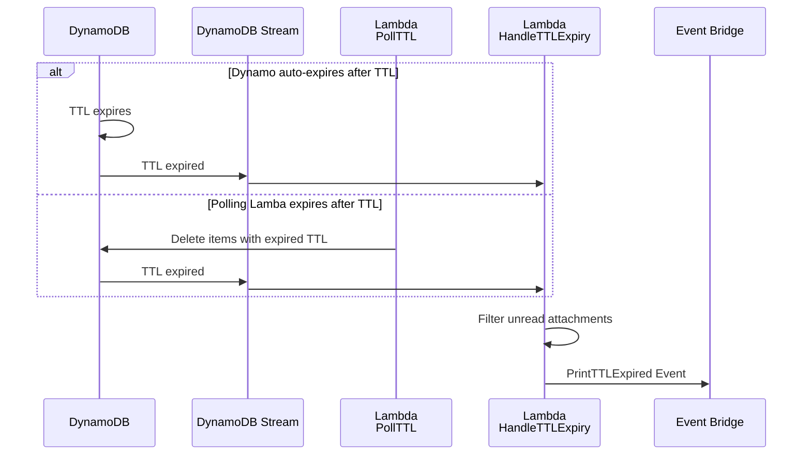

```mermaid
sequenceDiagram
  participant dynamo as DynamoDB
  participant stream as DynamoDB Stream
  participant expireTTL as Lambda<br/>PollTTL
  participant processTTLExpiry as Lambda<br/>HandleTTLExpiry
  participant eb as Event Bridge

  alt Dynamo auto-expires after TTL
    dynamo ->> dynamo: TTL expires
    dynamo ->> stream: TTL expired
    stream ->> processTTLExpiry:
  else Polling Lamba expires after TTL
    expireTTL ->> dynamo: Delete items with expired TTL
    dynamo ->> stream: TTL expired
    stream ->> processTTLExpiry:
  end
  processTTLExpiry ->> processTTLExpiry: Filter unread attachments
  processTTLExpiry ->> eb: PrintTTLExpired Event
```
