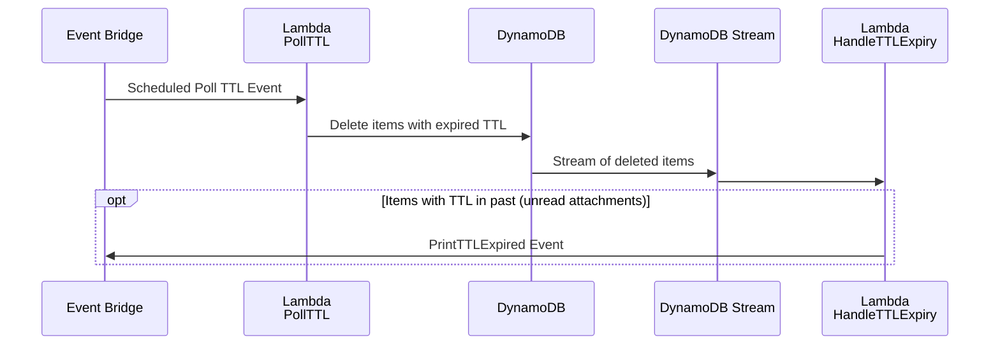

```mermaid
   sequenceDiagram
     participant eb as Event Bridge
     participant pollTTLLambda as Lambda<br/>PollTTL
     participant ddb as DynamoDB
     participant ttlStream as DynamoDB Stream
     participant handleTTLLambda as Lambda<br/>HandleTTLExpiry

    eb ->> pollTTLLambda: Scheduled Poll TTL Event
    pollTTLLambda ->> ddb: Delete items with expired TTL
    ddb ->> ttlStream: Stream of deleted items
    ttlStream ->> handleTTLLambda:
    opt Items with TTL in past (unread attachments)
      handleTTLLambda ->> eb: PrintTTLExpired Event
    end
```
