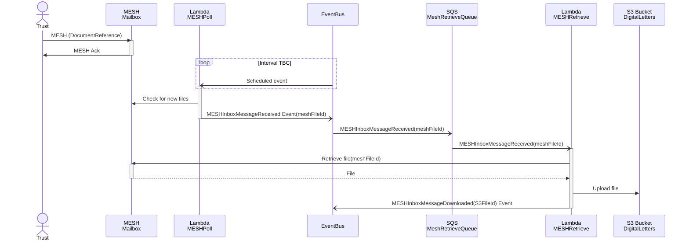

```mermaid

sequenceDiagram
  actor trust as Trust
  participant meshMailbox as MESH<br/>Mailbox
  participant meshPoll as Lambda<br/>MESHPoll
  participant eventBus as EventBus
  participant sqs as SQS<br/>MeshRetrieveQueue
  participant meshRetrieve  as Lambda<br/>MESHRetrieve
  participant s3 as S3 Bucket<br/>DigitalLetters

  trust ->> meshMailbox: MESH (DocumentReference)
  activate meshMailbox
    meshMailbox ->> trust: MESH Ack
  deactivate meshMailbox

  Loop Interval TBC
    eventBus -) meshPoll: Scheduled event
    activate meshPoll
  end
  meshPoll ->> meshMailbox: Check for new files
  meshPoll -) eventBus: MESHInboxMessageReceived Event(meshFileId)
  deactivate meshPoll

  eventBus -) sqs: MESHInboxMessageReceived(meshFileId)
  sqs -) meshRetrieve: MESHInboxMessageReceived(meshFileId)
  activate meshRetrieve
    meshRetrieve ->> meshMailbox: Retrieve file(meshFileId)
    activate meshMailbox
      meshMailbox -->> meshRetrieve: File
    deactivate meshMailbox
    meshRetrieve ->> s3: Upload file
    meshRetrieve -) eventBus: MESHInboxMessageDownloaded(S3FileId) Event
  deactivate meshRetrieve
```
