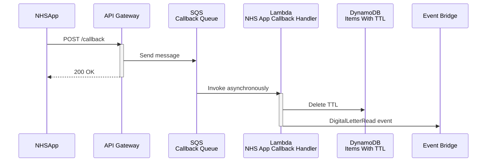

---

title: sequence-nhsapp-callback

---

```mermaid
    sequenceDiagram
    participant nhsapp as NHSApp
    participant apig as API Gateway
    participant sqs as SQS<br/>Callback Queue
    participant lambda as Lambda<br/>NHS App Callback Handler
    participant ddb as DynamoDB<br/>Items With TTL
    participant eb as Event Bridge

    nhsapp ->> apig: POST /callback
    activate apig
    apig ->> sqs: Send message
    apig -->> nhsapp: 200 OK
    deactivate apig
    sqs ->> lambda: Invoke asynchronously
    activate lambda
    lambda ->> ddb: Delete TTL
    lambda ->> eb: DigitalLetterRead event
    deactivate lambda
```
