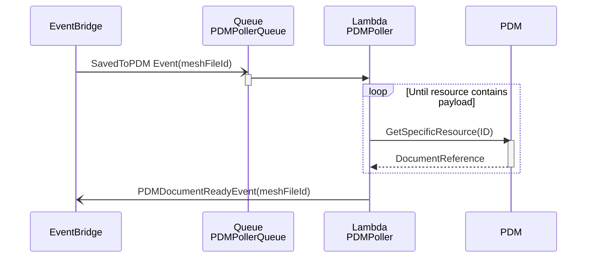

```mermaid

sequenceDiagram
  participant eventBus as EventBridge
  participant pdmPollerQueue as Queue<br/>PDMPollerQueue
  participant pdmPoller as Lambda<br/>PDMPoller
  participant pdm as PDM

  eventBus -) pdmPollerQueue: SavedToPDM Event(meshFileId)
  activate pdmPollerQueue
  pdmPollerQueue ->> pdmPoller:
  deactivate pdmPollerQueue
  loop Until resource contains payload
    pdmPoller ->> pdm: GetSpecificResource(ID)
    activate pdm
    pdm -->> pdmPoller: DocumentReference
    deactivate pdm
  end
  pdmPoller -) eventBus: PDMDocumentReadyEvent(meshFileId)
```
