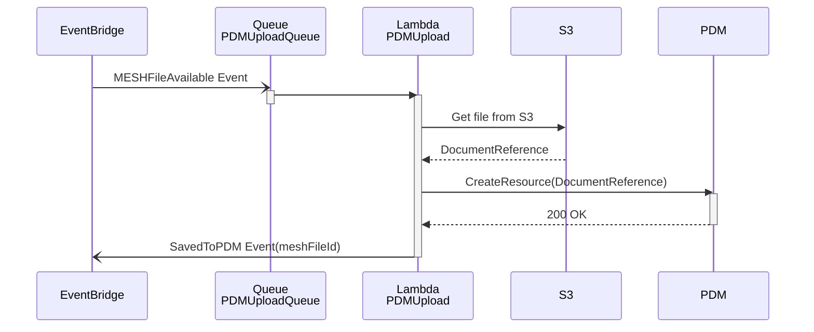

```mermaid

sequenceDiagram
  participant eventBus as EventBridge
  participant pdmUploadQueue as Queue<br/>PDMUploadQueue
  participant pdmUpload as Lambda<br/>PDMUpload
  participant s3 as S3
  participant pdm as PDM

  eventBus -) pdmUploadQueue: MESHFileAvailable Event
  activate pdmUploadQueue
  pdmUploadQueue ->> pdmUpload:
  deactivate pdmUploadQueue
  activate pdmUpload
  pdmUpload ->> s3: Get file from S3
  s3 -->> pdmUpload: DocumentReference
  pdmUpload ->> pdm: CreateResource(DocumentReference)
  activate pdm
  pdm -->> pdmUpload: 200 OK
  deactivate pdm
  pdmUpload -) eventBus: SavedToPDM Event(meshFileId)
  deactivate pdmUpload
```
